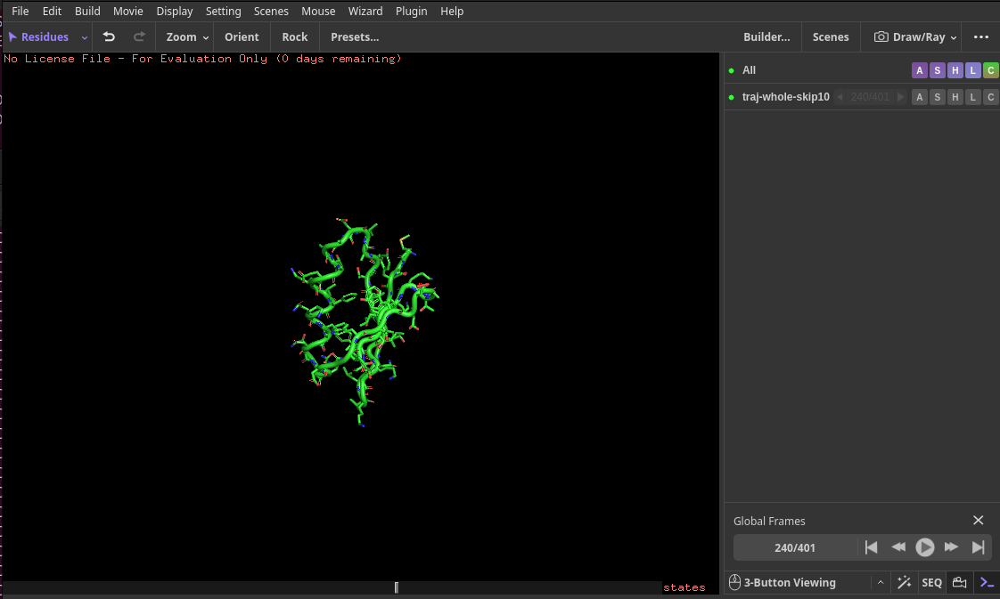
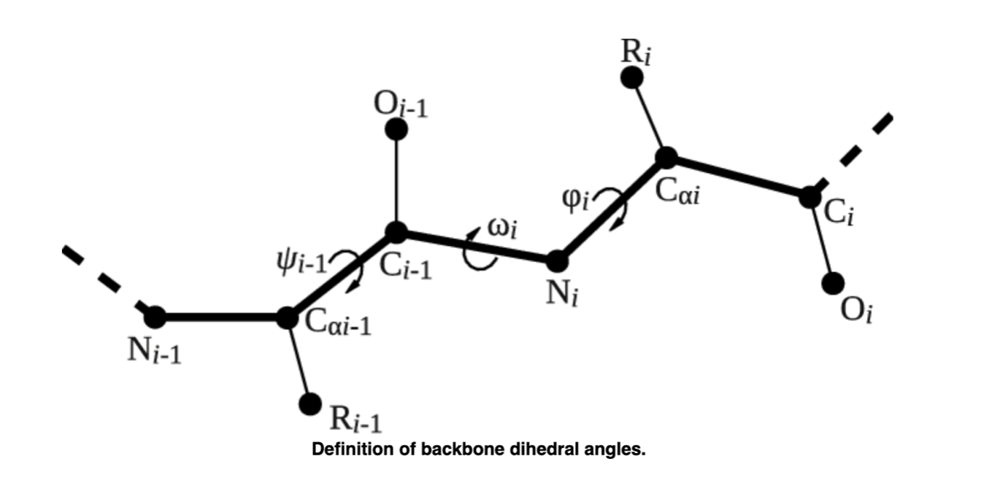
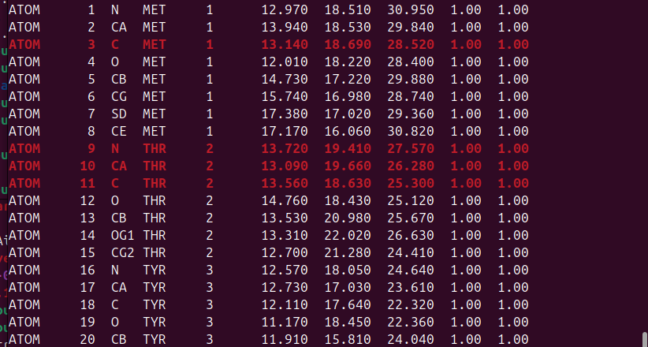
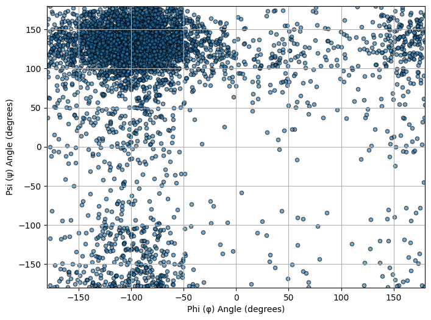

# A Brief Introduction to PLUMED Syntax and Making Histograms

The aim of this tutorial is provide an introduction to the PLUMED syntax. You will learn how to calculate some simple collective variables for analyzing existing trajectories.

Once this tutorial is completed students will be able to:

- Write a simple PLUMED input file and use it to analyze a trajectory
- Print collective variables such as distances, torsional angles, and coordination numbers using the PRINT action
- Be able to use PLUMED to calculate ensemble averages and histograms

**Files**
Files to complete this tutorial can be accessed here:
[tutorial files](coming soon)

These files are already located on bigzam:
/opt/workshop/intro_2_plumed/

## Getting Started

Use PuTTY to connect to bigzam as you did in the previous [tutorial](../lj_fluid/lj_fluid_tutorial.md). Open PuTTY from the Window Start menu and enter `bigzam.local` for the Host Name. Login using the terminal using your username and password. 

**Important**: Once connected to the workshop computer, set your environment variables by typing:


source setup.sh


Copy the tutorial files by typing in the terminal:

In the terminal type:

cp -r /opt/workshop/intro_2_plumed/ ~/


This will copy the necessary tutorial files to your home directory on bigzam.

**Tip**: You can press the Tab key to automatically complete file and directory names. This can save time and help avoid typing errors.

Move into the intro_2_plumed directory:


cd ~/intro_2_plumed


## What is PLUMED? 

So far we have been using GROMACS to build and run MD simulations. GROMACS comes with some analysis tools (such as RMSD, RMSF, and radius of gyration that you used in the previous tutorial). However, the features in GROMACS for analyzing trajectories are somewhat limited. Furthermore, some researchers may use other MD codes and analysis codes developed for one code may not be compatible with other MD codes. To overcome this issue, the MD community of researchers has developed a set of analysis tools called the The community-developed PLUgin for MolEcular Dynamics ([PLUMED](https://www.plumed.org/)) that can be used with several different MD codes. 

PLUMED is a plug-in library that can be incorporated into many MD codes including GROMACS. Once it is incorporated you can use PLUMED to perform a variety of different analyses on-the-fly and to bias the sampling in MD simulations as we will do in Day 2 of this workshop! Additionally, PLUMED can be used as a standalone code for analyzing trajectories. If you are using the code in this way you can run the PLUMED executable simply by issuing the command:


plumed


To see a list of all option that PLUMED can do, type the following into the terminal: 


plumed --help


The output of this command is a list of tasks that PLUMED can perform. In this tutorial we will use PLUMED as a post-processing tool to analyze MD simulation trajectories. The PLUMED tool for analyzing existing trajectories is the `driver` tool. Let's look at the options of PLUMED driver by issuing the following command:


plumed driver --help


This shows you a list of all the things we can do with the PLUMED driver. For all of these options, however, we are going to need to create a PLUMED input file. 
This tutorial will introduce you to the syntax of the PLUMED input file. We will use this syntax later in the second day of the workshop to run enhanced sampling simulations on-the-fly during a MD simulation, so all the things that you will learn now will be useful later when you will run PLUMED coupled to GROMACS.

## Computing and printing simple collective variables

Chemical systems contain an enormous number atoms, which, in most cases makes it simply impossible for us to understand anything by monitoring the atom positions directly. Consequently, we introduce Collective variables (CVs) that describe the chemical processes we are interested in and monitor these simpler quantities instead.

A collective variable is any mathematical function of the atomic coordinates that can be useful for tracking structural changes in a complex molecular system containing hundreds or thousands of atoms. Instead of tracking and visualizing each individual atom's motion, it is often more informative to monitor a few judiciously chosen collective variables (CVs) that can tell us about what structural state the molecule is in. 

In this tutorial, you will prepare input files to calculate and print some common simple collective variables on a pre-calculated trajectory. The trajectory is of the folding of the GB1 protein (Immunoglobulin-binding protein G, domain B1). This is a small 56-amino acid protein. The tutorial contains the following files:
- GB1_native.pdb: A PDB file of the native GB1 protein
- traj-whole.xtc: A GROMACS trajectory in .xtc format. GB1 has already been make whole by fixing the periodic boundary conditions using the `trjconv` code in GROMACS.
- traj-broken.xtc: The same GROMACS trajectory as it was originally produced by GROMACS. Here the protein molecule is artificially broken by the periodic box convention. 
- traj-whole-skip10.pdb: A pdb file of every 10th frame of the trajectory that you can use to view the folding simulation in PyMOL.

It is always a good idea to view the movie of the trajectory to try and understand the simulation before computing any collective variables. Use the WinSCP app on your Windows machine to transfer the traj-whole-skip10.pdb file to your local machine and load this into PyMOL. You should be able to see the protein folding around frame 240. 

Folding of GB1 around frame 240:

Recall that we skipped every 10 frames, so frame 240 corresponds to frame 2400 in the traj-whole.xtc trajectory. 

Now that you have a sense of the trajectory, we can compute and print some collective variables. One of the simplest collective variables (CV) we can monitor is the distance between two atoms. 

On bigzam, have a look at the first ten lines of the pdb file by typing:


head GB1_native.pdb


You should see the following:

ATOM      1  N   MET     1      12.970  18.510  30.950  1.00  1.00            
ATOM      2  CA  MET     1      13.940  18.530  29.840  1.00  1.00            
ATOM      3  C   MET     1      13.140  18.690  28.520  1.00  1.00            
ATOM      4  O   MET     1      12.010  18.220  28.400  1.00  1.00            
ATOM      5  CB  MET     1      14.730  17.220  29.880  1.00  1.00            
ATOM      6  CG  MET     1      15.740  16.980  28.740  1.00  1.00            
ATOM      7  SD  MET     1      17.380  17.020  29.360  1.00  1.00            
ATOM      8  CE  MET     1      17.170  16.060  30.820  1.00  1.00            
ATOM      9  N   THR     2      13.720  19.410  27.570  1.00  1.00            
ATOM     10  CA  THR     2      13.090  19.660  26.280  1.00  1.00            


In the pdb file atoms are indexed starting from 1 in the second column. Keep in mind that the numbering scheme in PLUMED also starts from 1. If you want to see that atom index for the alpha carbons for example, you can type:


grep 'CA' GB1_native.pdb


Here we see a list of just the alpha carbons (atom type CA):

ATOM      2  CA  MET     1      13.940  18.530  29.840  1.00  1.00            
ATOM     10  CA  THR     2      13.090  19.660  26.280  1.00  1.00            
ATOM     17  CA  TYR     3      12.730  17.030  23.610  1.00  1.00            
ATOM     29  CA  LYS     4      12.180  17.660  19.890  1.00  1.00            
ATOM     38  CA  LEU     5      10.250  15.790  17.220  1.00  1.00            
ATOM     46  CA  ILE     6      11.080  16.100  13.480  1.00  1.00            
ATOM     54  CA  LEU     7       8.010  15.160  11.390  1.00  1.00            
ATOM     62  CA  ASN     8       8.630  13.970   7.910  1.00  1.00            
ATOM     70  CA  GLY     9       5.210  12.640   6.970  1.00  1.00            
ATOM     74  CA  LYS    10       3.590  12.600   3.500  1.00  1.00            


Suppose we want to monitor the distance between atom CA on residue 1 and atom CA on residue 10 during the simulation. To do this, we can create a plumed file called `plumed_example1.dat` with the following lines:


d: DISTANCE ATOMS=2,74

PRINT ARG=d FILE=distance.dat STRIDE=1


In PLUMED, a variable should be given a name (in the example above, d), which is then used to refer to this variable in subsequent actions, such as the PRINT command. In the above input file, we define the variable d as the [DISTANCE](https://www.plumed.org/doc-v2.9/user-doc/html/_d_i_s_t_a_n_c_e.html) between atom 2 (CA on residue 1) and atom 74 (CA on residue 10). A lists of atoms should be provided as comma separated numbers, with no space.

Then we use the [PRINT](https://www.plumed.org/doc-v2.9/user-doc/html/_p_r_i_n_t.html) command to print the variable `d` to the output file we have named `distance.dat`. The STRIDE keyword sets how frequently to print to the output file. (STRIDE=1 means print every frame). 

Edit the `plumed_example1.dat` file by typing in the terminal:

nano plumed_example1.dat


Replace where you see the `__FILL__` string to be the atom numbers corresponding to CA on residue 1 and CA on residue 10 (`ATOMS=2,74`). Write changes by typing `Ctrl+O` followed by the `Enter` key. Then `Ctrl+X` to exit the text editor. 

Once your `plumed_example1.dat` file is complete, you can run the PLUMED driver as follows: 


plumed driver --plumed plumed_example1.dat --mf_xtc traj-whole.xtc


The --plumed flag signals the input PLUMED file to use (plumed_example1.dat) and the --mf_xtc flag signals the input trajectory file in GROMACS .xtc format (traj-whole.xtc). When you execute the above command, PLUMED writes a lot of information to the screen about the input that it is reading and the actions that it will execute. It is a good idea to take a moment to inspect this output and confirm PLUMED is actually doing what you intend to do.

The output file you have created is called `distance.dat`. Take a moment to look at the contents of this file by typing:


head distance.dat



#! FIELDS time d
 0.000000 1.440748
 1.000000 2.463681
 2.000000 1.931046
 3.000000 1.790541
 4.000000 2.524961
 5.000000 2.238710
 6.000000 2.477309
 7.000000 2.357945
 8.000000 1.561409


The first line is a comment that begins with `#!` and informs you about the content of each column. The first column is the time and the second column is our variable d. 

## A note about Units in PLUMED 

By default all PLUMED input and output quantities have the following units:

- Length: nanometers
- Energy: kJ/mol
- Time: picoseconds
- Mass: amu
- Charge: e

If you want to specify different units from these default units, you can do this using the [UNITS](https://www.plumed.org/doc-v2.9/user-doc/html/_u_n_i_t_s.html) keyword. For example, if I want to use energy units of Angstroms for distance and Hartree for energy and femtosecond (fs) for time, I could add the following line to the top of my `plumed.dat` input file:


UNITS LENGTH=A TIME=fs ENERGY=Ha

 
## Dihedral angles and MOLINFO shortcuts

A common property to characterize protein secondary structure are the backbone dihedral angles ($$\phi$$ and $$\psi$$). To calculate a dihedral angle in PLUMED, we use the [TORSION](https://www.plumed.org/doc-v2.9/user-doc/html/_t_o_r_s_i_o_n.html) action and a set of 4 atoms. For residue $$i$$, the dihedral $$\phi$$ is defined by these atoms: C(i-1),N(i),CA(i),C(i) and the dihedral $$\psi$$ is defined by the atoms: N(i),CA(i),C(i),N(i+1). 

Suppose we want to calculate the dihedral angle for residue Thr2. In the terminal, view the pdb file again by typing:


head -n 20 GB1_native.pdb


Here I have highlighted the atoms we would need to specify the $$\phi$$ angle for residue 2:

After inspecting `GB1_native.pdb` we can define the dihedral angle $$\phi$$ of residue 2 in plumed as follows:


phi_THR2: TORSION ATOMS=3,9,10,11


In this line, we define the variable `phi_THR2` and the torsion angle specified by the atoms 3,9,10, and 11 which correspond to C(i-1),N(i),CA(i),C(i) for residue 2. 

Similarly, we could calculate the $$\psi$$ angle for residue 2 by specifying the atoms N(i),CA(i),C(i),N(i+1). After quick inspection of the `GB1_native.pdb` file, the plumed command would be:


psi_THR2: TORSION ATOMS=9,10,11,16


This process of manually specifying 4 atoms for each torsion angle can be cumbersome, and fortunately, PLUMED provides some shortcuts to select atoms with specific properties. To use this feature, you need to include a MOLINFO line along with a reference PDB file. This command is used to provide information on the molecules that are present in your system. At the top of our plumed.dat file we add the line:


MOLINFO STRUCTURE=GB1_native.pdb


By specifying a pdb file as a reference structure using the MOLINFO action, we can use the following shortcuts to calculate the $$\phi$$ and $$\psi$$ angle for residue 2:


t1: TORSION ATOMS=@phi-2
t2: TORSION ATOMS=@psi-2
 

The PLUMED input file `plumed_example2.dat` will calculate the dihedral angles $$\phi$$ and $$\psi$$ for residue 2 using two different ways. Edit this file by typing:


nano plumed_example2.dat



MOLINFO STRUCTURE=GB1_native.pdb

phi_THR2: TORSION ATOMS=__FILL__
psi_THR2: TORSION ATOMS=9,10,11,16

t1: TORSION ATOMS=@phi-2
t2: TORSION ATOMS=__FILL__

PRINT ARG=phi_THR2,psi_THR2,t1,t2 FILE=dihedrals.dat STRIDE=1


Replace where you see the `__FILL__` with the correct information. Write changes by typing `Ctrl+O` followed by the `Enter` key. Then `Ctrl+X` to exit the text editor. After completing the PLUMED input file above, let's use it to analyze the trajectory traj-whole.xtc using the driver tool:


plumed driver --plumed plumed_example2.dat --mf_xtc traj-whole.xtc


The output file will be called `dihedrals.dat` and will contain the dihderal angle values calculated for each simulation frame. Notice how the MOLINFO command makes it particularly easy to calculate any protein dihedral angle we want. For instance suppose that you want to calculate and print the $$\phi$$ angle in the sixth residue of the protein and the $$\psi$$ angle in the eighth residue of the protein. You can do so using the following input:


MOLINFO STRUCTURE=GB1_native.pdb
phi6: TORSION ATOMS=@phi-6
psi8: TORSION ATOMS=@psi-8
PRINT ARG=phi6,psi8 FILE=dihedrals_r6_r8.dat


Copy your output file `dihedrals.dat` to your Windows machine using WinSCP. This file will have the following columns: 


#! FIELDS time phi_THR2 psi_THR2 t1 t2

 
The following script will generate a 2-D plot of $$\phi$$ vs. $$\psi$$:

[plot dihedral angle data](https://colab.research.google.com/drive/1reLdPMQjWHA6dcw79tao8fCFp56X49TU?usp=sharing)

## Radius of Gyration and Coordination Number

Let's now prepare a PLUMED input file to calculate:
- the radius of gyration defined by all the CA atoms.
- the total number of contacts (COORDINATION) between all protein CA atoms. 

Let's first get a list of indexes of the CA atoms by typing:

grep 'CA' GB1_native.pdb


A PLUMED file called `plumed_example3.dat` is included in the workshop files. Look at the `plumed_example3.dat` file by typing:
Let's first get a list of indexes of the CA atoms by typing:


cat plumed_example3.dat


The first line define a GROUP of atoms by specifying a long list of all the CA atoms. We define this GROUP with the variable name ca. We can now refer to this list with the variable name ca.


ca: GROUP ATOMS=2,10,17,29,38,46,54,62,70,74,83,90,98,107,111,120,127,134,141,150,155,162,170,175,180,187,192,201,210,217,228,237,246,258,263,271,279,287,291,298,306,310,319,333,340,352,360,368,373,380,389,396,407,414,421,428


We now refer to this list and tell PLUMED to calculate the radius of gyration (GYRATION) for this group. This variable will be stored with the name `Rg`. 


Rg: GYRATION ATOMS=ca


Next we tell PLUMED to calculate the COORDINATION among the ca GROUP and store this variable with the name `Co`:


Co: COORDINATION GROUPA=ca R_0=0.8


In the above line, the COORDINATION is defined as any distance between atoms within the group that is less than a cutoff distance specified by `R_0`, which we set here to 0.8 nm. (Recall that nm is the default units for PLUMED). 

Finally, last line tells PLUMED to print the value of the variables Rg and Co to a file called COLVAR for each frame of the simulation. 


PRINT ARG=Rg,Co FILE=COLVAR STRIDE=1


Once you understand the lines of this PLUMED input file, run the calculation with the driver:


plumed driver --plumed plumed_example3.dat --mf_xtc traj-whole.xtc


This will create a COLVAR file like this one:

#! FIELDS time Rg Co
 0.000000 2.458704 165.184127
 1.000000 2.341932 164.546604
 2.000000 2.404708 162.606975
 3.000000 2.454297 143.850122
 4.000000 2.569342 147.110408
 5.000000 2.304027 163.608703
 6.000000 2.116676 177.549800
 7.000000 2.068599 183.177947
 8.000000 2.021605 181.929951


Notice that the first line informs you about the content of each column.

## Virtual Atoms 

Sometimes, when calculating a CV, you may not want to use the positions of a number of atoms directly. Instead you may want to define a virtual atom whose position is generated based on the positions of a collection of other atoms. For example you might want to use the center of mass (COM) or the geometric center (CENTER) of a group of atoms.

Look at the PLUMED example input file `plumed_example4.dat` by typing:


cat plumed_example4.dat



# geometric center of first residue
first: CENTER ATOMS=1,2,3,4,5,6,7,8
# geometric center of last residue
last: CENTER ATOMS=427-436
# distance between centers of first and last residues
d1: DISTANCE ATOMS=first,last
# print the distance every step
PRINT ARG=d1 STRIDE=1 FILE=distance_r1_r56.dat


In this example, we are defining a variable named `first` as the geometric center of the first residue of the protein and a variable named `last` as the geometric center of the last residue. We then calculate the distance between these "virtual" atoms and print this to a file `distance_r1_r56.dat`. 

Once you understand the PLUMED input file containing the above instructions, you can execute it on the trajectory using the following command:


plumed driver --plumed plumed_example4.dat --mf_xtc traj-whole.xtc


## Ensemble Averages and Making Histograms 

By now you should have generated three time-series data files for the GB1 trajectory:
- distance.dat: This is the distance between CA atoms on residues 1 and 10 from example 1.
- COLVAR: This is the radius of gyration (Rg) and COORDINATION (Co) of the CA carbon group from example 3.
- distance_r1_r56.dat: This is the distance between the geometric centers of residue 1 and residue 56 from example 4. 

Let's plot these by transferring each of these files to your Windows machine using the WinSCP app. A Python code for plotting these files is provided here:

[code to plot_distances](https://colab.research.google.com/drive/18VzTAY32tEFRc-WJmuUM8pYAk4By-LHp?usp=sharing)

