# Simulation of Liquid Argon

In this tutorial you will learn how to perform a molecular dynamics (MD) of liquid argon using the GROMACS MD package. 

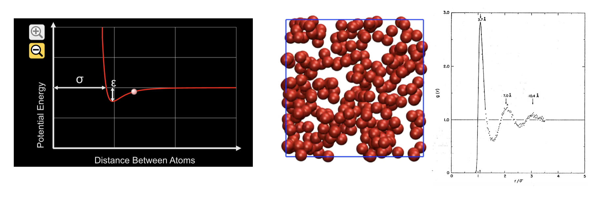

The total interaction energy between a pair of Argon atoms is the sum of the attractive induced dipole (van der Waals interaction) and the short-ranged repulsive interaction between electron clouds. This short-ranged repulsive interaction acts as a barrier preventing the two atomic nuclei from sitting closer than their combined van der Waals radii. You can see an interactive PhET simulation of this interaction [here](https://phet.colorado.edu/sims/html/atomic-interactions/latest/atomic-interactions_all.html).

The interaction between atoms is modeled by two parameters: $$\sigma$$ which determines the van der Waals radius (in distance units), and $$\epsilon$$ which determines the depth of the attractive potential energy minimum (in energy units).

Once this tutorial is completed students will be able to:

- Understand the basic format of GROMACS structure, topology, and parameter files
- Prepare a simple fluid simulation and run a molecular dynamics simulation of this model.
- Calculate the radial distribution function for a fluid and connect to scattering experiments.
- Calculate the mean square displacement (MSD) and use the plot of MSD vs. time to estimate the diffusion coefficient. 

**Files**
Files to complete this tutorial can be accessed here:
[tutorial files](coming soon)

These files are already located on bigzam:
/opt/workshop/lj-fluid/

## Getting Started: Connecting to the Workshop Computer

During the workshop, you will run molecular dynamics simulations on a Linux workstation named bigzam. Follow these instructions for connecting to this computer remotely. 

#### Open PuTTY

Open **PuTTY** from the Windows Start menu. You shouldd see the PuTTY Configuration window:

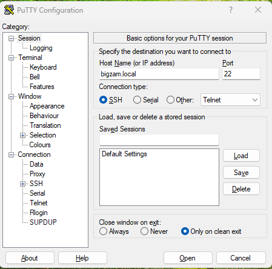

In the Host Name (or IP address) box, enter:


bigzam.local


Make sure that the **Port** is set to 22 and the **Connection type** is set to SSH. Click **Open** and accept the Security Warning.

#### Log In using the terminal window

A terminal window will open. Enter the username provided to you at the start of the workshop and press Enter. Next, enter your assigned password and press **Enter**

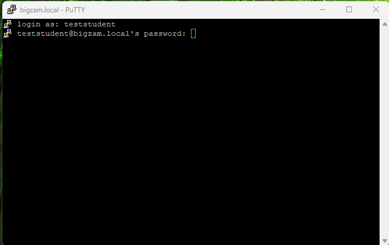

**Important**: When you type your password, nothing will appear on the screen. You will not see letters or dots.

After successfully logging in, you should see a command prompt similar to:


username@bigzam:~$


You are now connected to the workshop computer.

#### Set your environment variables

**Important**: You need to do this step every time you log in to bigzam. This will ensure the correct software is in your path. In the terminal type:


source setup.sh


#### Copy the Simple Fluid Tutorial Files  

In the terminal type:

cp -r /opt/workshop/lj-fluid/ ~/


This will copy the necessary tutorial files to your home directory on bigzam.

**Tip**: You can press the Tab key to automatically complete file and directory names. This can save time and help avoid typing errors.

Check that you see the lj-fluid directory by typing:


ls


The ls command lists the files and directories in your current location.

Move into the lj-fluid directory:


cd lj-fluid


From this directory, if you type `ls`, you should see the following:

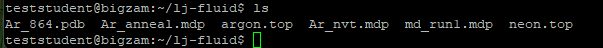

#### Useful Terminal Commands

| Command           | Description                    |
| ----------------- | ------------------------------ |
| `pwd`             | Show your current directory    |
| `ls`              | List files and directories     |
| `cd directory`    | Move into a directory          |
| `cd ..`           | Move up one directory          |
| `mkdir directory` | Create a new directory         |
| `clear`           | Clear the terminal screen      |
| `exit`            | Log out of the remote computer |

## GROMACS
GROMACS is an open source MD simulation package. On the [GROMACS homepage](https://www.gromacs.org/) you can find more information about the software and documentation. To run a simulation, we need three input files:

- a structure file, containing the atomic coordinates of the system to be simulated
- a molecular topology file, containing the force field parameters, a description of the bonds, angles, etc …, of the system
- a simulation parameter file, containing information about the type of simulation, number of steps, temperature, etc …

For argon, the atomic nuclei are treated as point particles and there are no bonds or angles. The starting structure was generated by placing point particles on a fcc lattice. The system contains 864 argon atoms with a system density of 1.374 g/cm$$^3$$

#### Structure File

In this case, we will use a structure file in pdb format: [Ar_864.pdb](https://github.com/jamesmccarty/LiquidArgon/blob/main/Ar_864.pdb). You can view the first ten lines of this file by typing in the terminal:


head -n 10 Ar_864.pdb 


Looking at the file we see that each atom has a number, an atom name Ar and a x,y,z position. You can read more about the pdb file format [here](https://www.cgl.ucsf.edu/chimera/docs/UsersGuide/tutorials/pdbintro.html).


HEADER    simple PDB file with 864 atoms
CRYST1   34.681   34.681   34.681  90.00  90.00  90.00 P 1           1
ATOM      1 Ar   Ar  A   1       0.000   0.000   0.000  1.00  0.00
ATOM      2 Ar   Ar  A   2       2.890   2.890   0.000  1.00  0.00
ATOM      3 Ar   Ar  A   3       2.890   0.000   2.890  1.00  0.00
ATOM      4 Ar   Ar  A   4       0.000   2.890   2.890  1.00  0.00
...


## Transfering files between Bigzam and your Windows computer

Copy the pdb file back to your local computer using **WinSCP** app from the Windows Start menu. You shouldd see the WinSCP window:

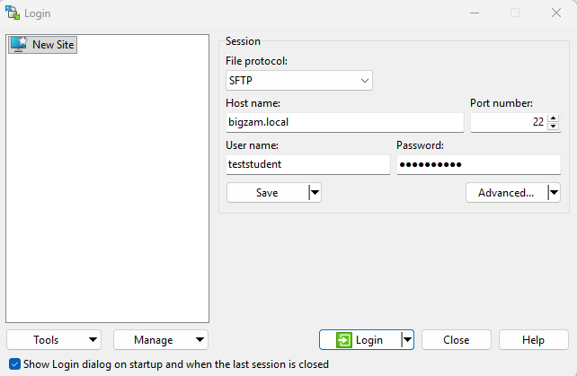

In the Host Name box, enter:


bigzam.local


Make sure **File protocol** is set to SFTP and **Port number** is 22. Enter your assigned User name and Password in the corresponding boxes and hit the Login button and accept the Security Warning. You should see a window that looks similar to the following:

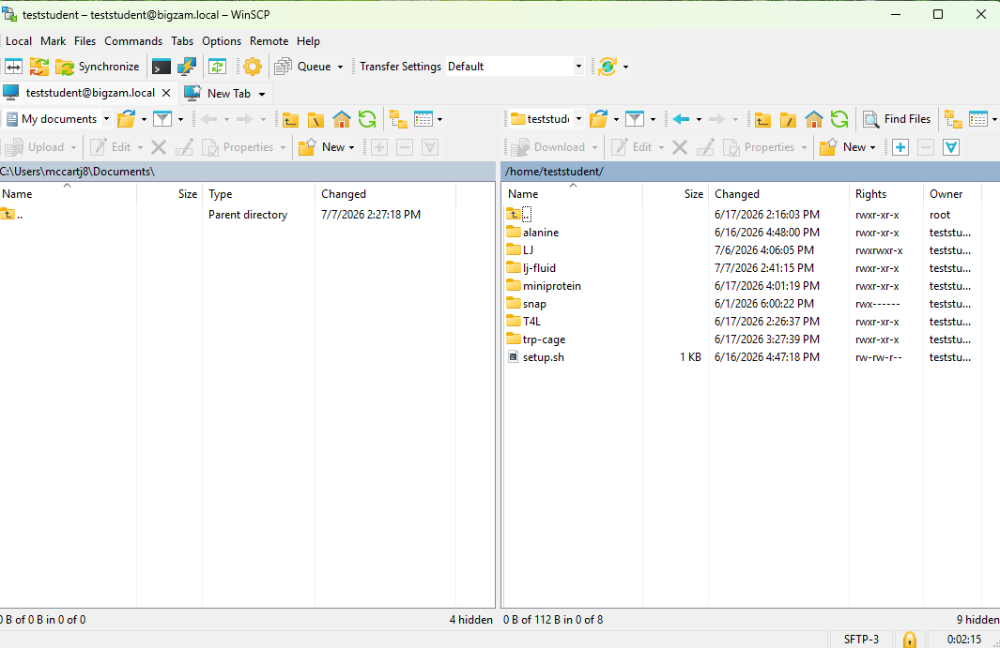

On the right panel are your files on bigzam, and on the left panel are your files on your local Windows machine. In the right panel, double click on the lj-fluid folder to see the contents of the folder. Copy the `Ar_864.pdb` file to your local Windows machine by dragging this file from the right panel to the left panel. 

To visualize the pdb format you can load the pdb file into PyMOL on your local Windows machine:

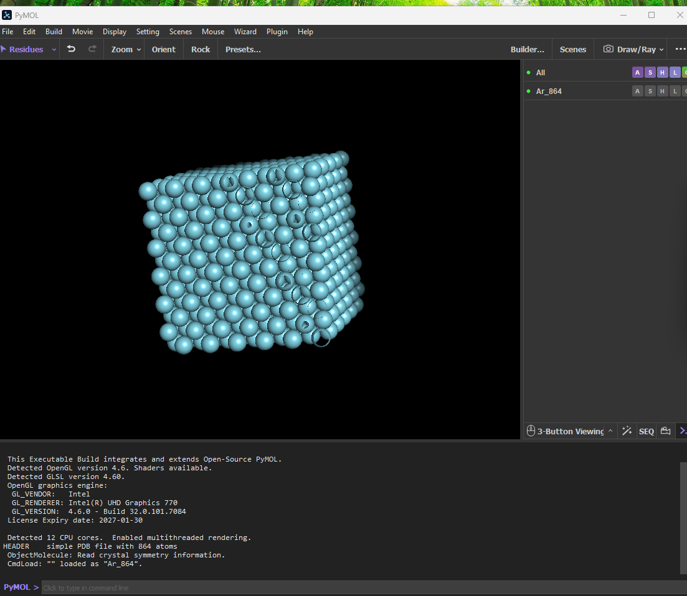

Use the "right click" on the mouse to zoom in or out of the lattice structure. Notice that the argon atoms are arranged on a lattice to start.

#### Topology File

Now let's have a look at the topology file [argon.top](https://github.com/jamesmccarty/LiquidArgon/blob/main/argon.top). View the first ten lines of the topology file by typing:


head argon.top 


The `atomtypes` section contains information about the force field parameters for each atom type. Here we have one atom type AR for the argon atoms:


[ atomtypes ]
AR  39.948    0.0   A     0.006165     9.523537e-06


The first column defines the atom type parameters for the Argon atom. The second column is the mass in a.m.u. The third column is the charge. The last two columns are the parameters for the potential energy function that determines the van der Waals radius and attractive well depth. You can find more information about these parameters ... [here](https://manual.gromacs.org/documentation/2019/reference-manual/topologies/parameter-files.html).

**Key idea**: In order to run any MD simulation, we will always need a structure file that specifies the atomic positions (such as the .pdb file) and a topology file (.top) that specifies how the interactions between atoms should be treated. 

#### MD Parameter File

In addition to a structure file (.pdb) and topology file (.top), we also need a MD simulation parameter file that includes the instructions on how to run the MD simulation. All of this information is contained in the MD parameter file [md_run1.mdp](https://github.com/jamesmccarty/LiquidArgon/blob/main/md_run1.mdp). Have a look at this file by typing:


cat md_run1.mdp


Note: `cat` prints the entire file content to the screen, whereas `head` prints the first 10 lines and  `tail` prints the last 10 lines.

The beginning section defines the MD simulation run parameters. Here we use the leap-frog integrator with a time step of 0.002 ps for 50000 steps.


;Run parameters
integrator	= md		; leap-frog integrator
nsteps		= 50000		; 2 * 50000 = 100 ps
dt		= 0.002		; 2 fs


The next section controls how often to print to the output files that will be generated during the simulation:


; Output control
nstxout-compressed = 500        ; save coordinates in compressed xtc format
nstxout = 0
nstvout = 0
nstfout = 0
nstenergy       = 500           ; save energies every 1.0 ps
nstlog          = 500           ; update log file every 1.0 ps


 The remain sections specify more details about the simulation. The temperature is controlled with the following section:


; Temperature coupling is on
tcoupl		= v-rescale             ; modified Berendsen thermostat
tc-grps         = System
tau-t		= 0.1	        ; time constant, in ps
ref-t		= 94.4	        ; reference temperature, one for each group, in K


In the above we set the reference temperature to 94.4 K. The last section specifies that GROMACS should generate initial velocities of particles by randomly drawing from a Maxwell-Boltzmann distribution at 94.4 K.


; Velocity generation
gen_vel		= yes		; Velocity generation is on
gen_temp                 = 94.4 ; generate initial velocities at this temperature
gen_seed                 = -1


Once you have a familiarity with these input file, we are ready to perform an MD simulation to propogate the motion of the atoms over time. 

#### Generate GROMACS binary run input file and run the MD simulation

Running an MD simulation in GROMACS requires two steps. First, we use the GROMACS preprocessor command `grompp` to prepare a binary run input file that GROMACS can read and execute. Second, we run the simulation using the `mdrun` command. First run the GROMACS preprocessor by typing the following in the terminal:


gmx grompp -f md_run1.mdp -c Ar_864.pdb -p argon.top -o md_run1.tpr


Here the -f flag indicates the input MD parameter file, the -c flag indicates the input structure file, the -p flag indicates the input topology file. The -o flag specifies the output file name which is the binary run input file. Now we are ready to run the simulation using the `mdrun` command:


gmx mdrun -v -s md_run1.tpr -deffnm md_run1 -nt 1


The -s flag signals the input binary run input file. The -deffnm flag signals the prefix for all of the output files that will be produced as the simulation runs. These output files include the trajectory file (.xtc), a checkpoint file for restarting (.cpo), the final coordinates (.gro), the output energy file (.edr), and the output simulation log file (.log). All these files will be created during the simulation run. 

During this 100 ps simulation, the argon atoms will melt from the lattice structure and become a liquid. The temperature should equilibrate to 94.4 K and the potential energy should reach a stable equilibrium. To check the temperature and energy, we can look at the instantaneous quantities in the md_run1.edr file. To check the temperature:


gmx energy -f md_run1.edr -o temperature.xvg -xvg none


Type "8 0" at the prompt to select the temperature and hit enter. This will create a `temperature.xvg` file will have the time vs. temperature over the course of the simulation. You can plot this with any plotting tool.

For this example, you can copy your `temperature.xvg` file to your local machine using WinSCP by dragging the newly create `temperature.xvg` file from the right panel to the left panel as seen here:

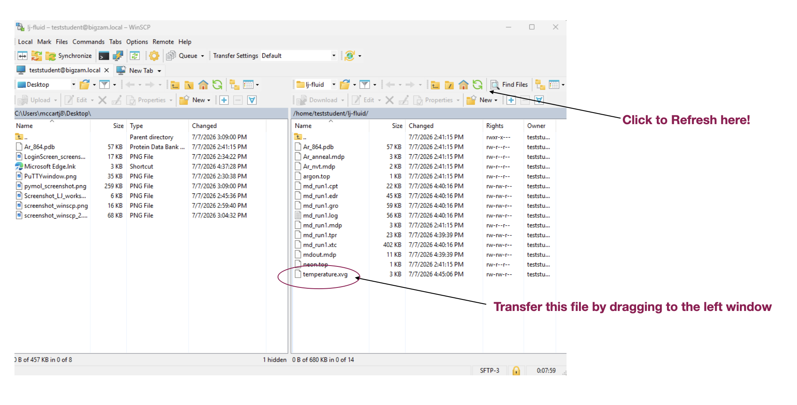

Then you can plot this file using any plotting tool you normally use. For example, you can use Python by following Google Colab link and uploading your temperature.xvg file:

[simple plotting code](https://colab.research.google.com/drive/19TW4aycUOPRcPWVzK8U2fh3190kTYYde?usp=sharing)

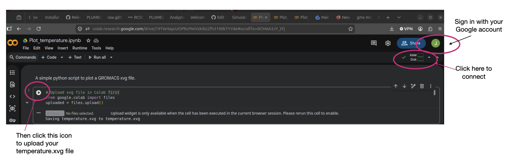

**Optional Extension**: See if you can repeat this procedure to plot the potential energy. Does the potential energy reach a stable equilibrium?

#### Extending the Simulation

The first run was to melt the argon atoms from the initial lattice position to generate an equilibrated liquid at 94.4 K. Now, we can run a longer simulation that we can use to compute properties of the liquid.

**Key idea**: The initial structure in the starting structure file is typically not the equilibrium structure. In general, whenever you run an MD simulation for a new system, you will always run a short equilibration simulation before running a longer "production" simulation for calculating properties of interest. 

Have a look at the MD parameter file: [Ar_nvt.mdp](https://github.com/jamesmccarty/LiquidArgon/blob/main/Ar_nvt.mdp). This file should look very similar to the previous MD parameter file with a few exceptions. First, we specify that this will be a continuation from a previous simulation. Second, we are no longer generating velocities since we are continuing from our previous simulation.

Now we run the GROMACS preprocessor again to generate a new binary run input file for the longer simulation:


gmx grompp -f Ar_nvt.mdp -c md_run1.gro -t md_run1.cpt -p argon.top -o Ar_nvt.tpr


Notice here the input coordinate file is now the `md_run1.gro` file that we generated in our previous simulation. This is the final coordinates from our equilibration simulation. Also, we have added the -t flag to indicate to restart the simulation from the previous checkpoint file. Now we run the simulation as before with:


gmx mdrun -v -s Ar_nvt.tpr -deffnm Ar_nvt -nt 1 


This will generate a 1 ns (1000 ps) trajectory called `Ar_nvt.xtc.` All of the information about the postions of the atoms over time are stored in the .xtc file.  
#### Visualizing the simulation

If we want to visualize a movie of the trajectory we can convert the `Ar_nvt.xtc` file to a pdb file that can be viewed in PyMOL. Type in the terminal:


gmx trjconv -s Ar_nvt.tpr -f Ar_nvt.xtc -o Ar_trajectory.pdb


When prompted, select Group 0 for System and hit enter. 

Again transfer this file from bigzam onto your Windows machine using WinSCP. Then load the full trajectory into PyMOL. Although the motion of the atoms appears random, the liquid has an underlying structure that we can analyze.  

#### Analyzing the simulation

The [radial distribution function](https://en.wikipedia.org/wiki/Radial_distribution_function) is an important property of a fluid and is used to quantify the liquid structure. To calculate the radial distribution function using GROMACS, in the terminal type:


gmx rdf -s Ar_nvt.tpr -f Ar_nvt.xtc -o rdf.xvg -xvg none  


When prompted select Group 0 for the 'ref' and Group 0 for the 'sel' and then type Ctrl-D to run the calculation. This will produce the output radial distribution function as a data file that you can plot in your favorite plotting program. For this tutorial, transfer the `rdf.xvg` file to your Windows machine using WinSCP as before. 

Then upload your file to the Python Google colab document here:

[radial distribution plotting code](https://colab.research.google.com/drive/1SmDuXhKx7UsHeGMFHRz0nwDZThzeXwLP?usp=sharing)

An example is shown here:

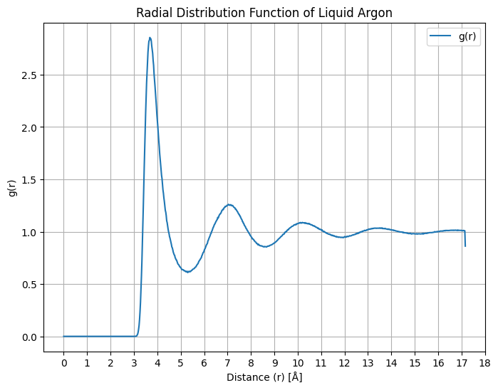

The first peak corresponds to the first solvation shell and is reported in the literature as 3.7 $$\r{A}$$. To compare with experimental X-ray diffraction data, we need to compute the numerical Fourier Transform of the radial distribution function. The Python Google colab document includes a script to download the experimental data, perform the Fourier Transform, and plot the scattering function. An example plot is shown here:

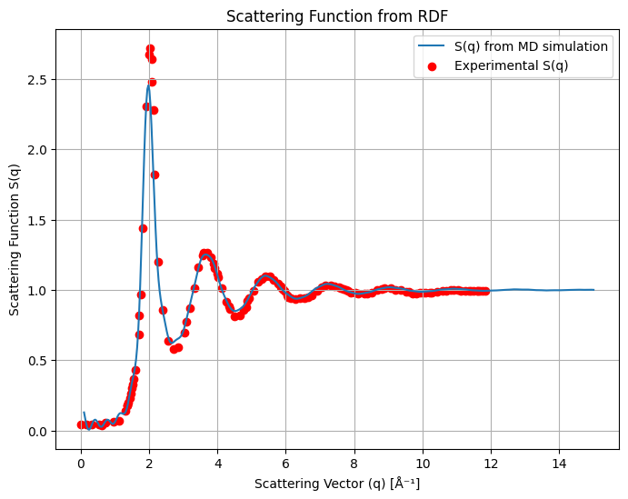 

Another fluid quantity of interest is the [mean squared displacement](https://en.wikipedia.org/wiki/Mean_squared_displacement) of the atoms. This can be used to analyze the self diffusion of Ar atoms from the Einstein relation: $$\lim _{t \rightarrow \infty}\left\langle\left\|\mathbf{r}_{i}(t)-\mathbf{r}_{i}(0)\right\|^{2}\right\rangle=6 D t$$

To calculate the mean squared displacement:


gmx msd -s Ar_nvt.tpr -f Ar_nvt.xtc -o msd.xvg -xvg none    


Select group 0 for System when prompted. Here we see that fitting the mean squred displacement from 100 to 900 ps gives a straight line whose slope is related to the diffusion coefficient:


D[   System ] 2.4641 (+/- 0.0890) 1e-5 cm^2/s


The value from the literature at 94.4 K is reported as $$D=2.43\times 10^{-5}$$ cm$$^2$$/s.

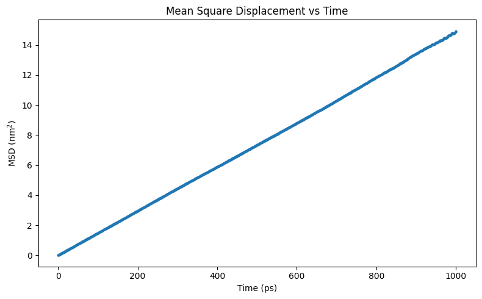

Congratulations, you have completed this tutorial. At this point, you should now move on to the mini-protein tutorial [here](../mini-protein/mini-protein_tutorial.md) If you have extra time at the end of the day, you can consider the following optional extensions. 
 
#### Optional Extention 1  

A topology file for neon (`neon.top`) is included in the workshop tutorial files. Set up and run a MD simulation of liquid neon and compare the diffusion coefficient between neon and argon atoms. 

#### Optional Extention 2

The MD parameter file `Ar_anneal.mdp`will cool the system from 94.4 K to 10 K. To run this simulation starting from our previous simulation, type:


gmx grompp -f Ar_anneal.mdp -c Ar_nvt.gro -t Ar_nvt.cpt -p argon.top -o Ar_anneal.tpr


followed by


gmx mdrun -v -s Ar_anneal.tpr -deffnm Ar_anneal -nt 1   


See if you can make a plot of the temperature as a function of the simulation time. Does the temperature behave as you expect?

Run a longer trajectory of argon at 10 K and compare the radial distribution with that at 94.4 K. What can you infer about the structure at 10 K? 

References: 

- [A. Rahman, “Correlations in the Motion of Atoms in Liquid Argon”, Phys. Rev. Lett. 136, A405, 1964.](https://journals.aps.org/pr/abstract/10.1103/PhysRev.136.A405)

[Return to Day 1 homepage](../../day1.md)
