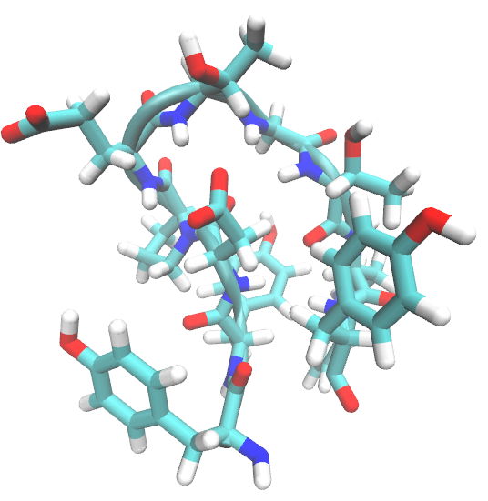
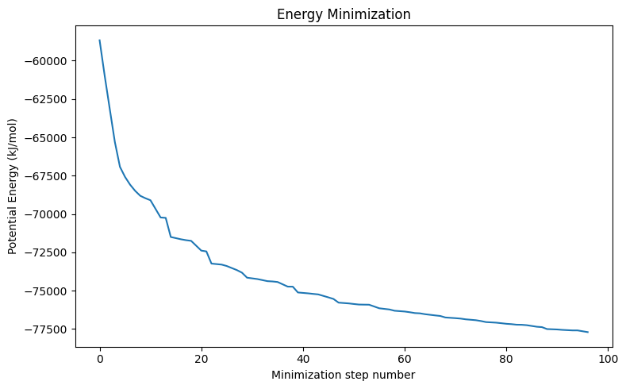
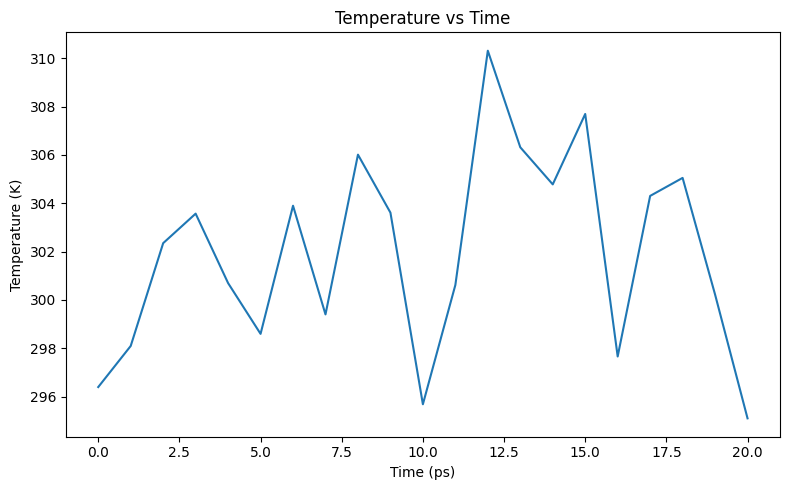

# Simulation of miniprotein in water

In this tutorial you will use GROMACS in the Unix command line to build and equilibrate a solvated protein system for the mini-protein [YYDPETGTWY](https://pubs.acs.org/doi/10.1021/ja8030533). The goal is to understand the MD simulation parameters that are chosen and the details about how the system was built.

Once this tutorial is completed students will be able to:

- Set up a protein in explicit solvent for MD simulation
- Understand GROMACS output files and be able to transfer files for analysis
- Calculate RMSD and monitor structural stability and fluctuations

**Files**
Files to complete this tutorial can be accessed here:
[tutorial files](coming soon)

These files are already located on bigzam:
/opt/workshop/miniprotein/

## Getting Started

Use PuTTY to connect to bigzam as you did in the previous [tutorial](../lj_fluid/lj_fluid_tutorial.md). Open PuTTY from the Window Start menu and enter `bigzam.local` for the Host Name. Log in using the terminal using your username and password:

Once connected to the workshop computer, set your environment variables:


source setup.sh


Copy the miniprotein tutorial files by typing in the terminal:

In the terminal type:

cp -r /opt/workshop/miniprotein/ ~/


This will copy the necessary tutorial files to your home directory on bigzam.

**Tip**: You can press the Tab key to automatically complete file and directory names. This can save time and help avoid typing errors.

Move into the miniprotein directory:


cd ~/miniprotein


From this directory, you will run the simulation. 

## Convert a pdb structure file (.pdb) to a GROMACS topology (.top) and structure (.gro) file

The Protein Data Bank (PDB) file [2RVD.pdb](https://www.rcsb.org/structure/2RVD) was obtained from NMR experiment and contains 20 conformers. We will only need to first conformer for starting our simulation. 

We first need to convert this pdb file to a format that GROMACS uses. The GROMACS command `pdb2gmx` will generate a GROMACS topology file (.top), a position restraint file (posre.itp), and a GROMACS structure file (.gro). Generating a topology file can sometimes be tricky if there are missing atoms, non-standard amino acids, or small molecules in the pdb file. A basic usage of `pdb2gmx` is 


gmx pdb2gmx -f 2RVD.pdb -o conf.gro -p topol.top -ignh
   

where -f signals the input pdb file, here called `2RVD.pdb` and -o is the output structure file and -p is the output topology file. The flag -ignh means to ignore H atoms in the PDB file. The -ignh flag is useful to deal with non-conventional naming of H atoms in pdb files; however, if you need to persevere the exact position of the H coordinates in the structure file, then you should not use the -ignh flag.

Typing the above command will prompt you to select a force field. The force field is the set of parameterized potential energy functions that are used to calculate all the forces acting on the atoms. A number of force field models are provided within GROMACS. Select the force field model by typing the appropriate number and hitting the Enter/Return key. You will also be prompted to select a water model. For this tutorial select the AMBER99SB-ILDN force fields from [Lindorff-Larsen et al., Proteins 78, 1950-58, 2010](https://onlinelibrary.wiley.com/doi/full/10.1002/prot.22711), and when prompted, select the TIP3P water model. You should now have generated a structure file conf.gro, a topology file topol.top, and a position restraint file posre.itp.

The topology file `topol.top` contains all the information necessary to define the molecule within a simulation. This information includes nonbonded parameters (atom types and charges) as well as bonded parameters (bonds, angles, and dihedrals).

## Defining a simultion box and adding solvent molecules to the box

Now that we have converted the protein pdb structure file into a GROMACS topology and structure file, we need to define a simulation box. To create a simulation box of specified dimensions, use the `editconf` command by typing in the terminal:


gmx editconf -f conf.gro -o conf_box.gro -c -d 1.0 -bt cubic


The -f flag signals the input GROMACS structure file (conf.gro) which we created above. The -o signals a new output structure file (conf_box.gro) which contains the box definition. The -c flag centers the protein in the box, and the -d specifies a minimum distance from the protein to the edge of the box (in nm). Specifying a solute-box distance of 1.0 nm means that there are at least 2.0 nm between any two periodic images of a protein. This distance will be sufficient for just about any cutoff scheme commonly used in simulations. The -bt cubic flag indicates to use a cubic box shape. 

Now that we have generated a simulation box, which we must fill with water. We add solvent by typing


gmx solvate -cp conf_box.gro -cs spc216.gro -o conf_solv.gro -p topol.top


The input structure file is signaled by the -cp flag and is the structure file that was generated by the previous command (conf_box.gro). The -cs flag is the solvent configuration structure file that comes standard with a GROMACS installation. We are using spc216.gro, which is a generic equilibrated 3-point solvent model. You can use spc216.gro as the solvent configuration for SPC, SPC/E, or TIP3P water, since they are all three-point water models. The -o flag indicates a new output structure file that contains both the protein and the solvent (conf_solv.gro). The -p flag is our topology file generated above, which will be modified to include the solvent force fields as well.

**WARNING** When you run the `gmx solvate` command, the topology file is modified. This means that if you run this command more than once on the same topology file, you will get a mismatch in atoms between your structure file and topology file that can lead to errors later on. Whenever GROMACS modifies an existing file, a backup of the original file is created starting with a hashtag (#topol.top). 

## Adding ions

Usually, we will want to add small molecule ions (NaCl) in order to neutralize the system (if the protein has a nonzero net charge) and to perform the simulation at physiological or experimental salt conditions. The GROMACS command `genion` will randomly replace water molecules with ions. In order to run `genion` we need to generate a compiled GROMACS input file (.tpr) file. A .tpr file contains information from both the structure file (.gro) and topology file (.tpr) and is generated using the grompp (GROMACS pre-processor) command, which will also be used later when we run our first simulation. 

To produce a processed input (.tpr) file, we need an additional input file with extension .mdp (molecular dynamics parameter file) that contains specified parameters for running a simulation. For this tutorial, you can use the `ions.mdp` file provided. Generate the .tpr file by typing the following in the terminal:


gmx grompp -f ions.mdp -c conf_solv.gro -p topol.top -o ions.tpr


where -o specifies the output .tpr file which we have called `ions.tpr`. Now that you have generated the `ions.tpr` file, you can add small ions with the command:


gmx genion -s ions.tpr -o conf_solv_ions.gro -p topol.top -conc 0.15 -neutral


where the -conc signals to make the final ion concentration 0.15 M and -neutral signals to neutralize the system so that the net charge in the system is zero. GROMACS will randomly replace certain molecules with small ions to reach our specified concentration and charge balance. When prompted select group 13 for SOL, which is the solvent group. This will tell GROMACS to replace some of the solvent molecules with small ions. 

Congratulation, you have now built a simulation box containing a small protein, water, and ions. To run an MD simulation of this model, we will need the generated GROMACS structure file (conf_solv_ions.gro) that contains the initial positions of all the atoms in the simulation box and the GROMACS topology file (topol.top), that contains information on how to handle the calculation of the forces on the atoms. Before performing an MD simulation of this model, we will first perform an energy minimization of this structure to relax any steric restraints. 

## Energy minimization 

Before we can run a MD simulation, we need to relax the system to remove steric clashes or unphysical geometries. To run an energy minimization we need another parameter file (em.mdp) file that contains the parameters for the energy minimization. An example em.mdp file is provided with the workshop tutorial files. Again we use the grompp command to compile a GROMACS .tpr file as follows:


gmx grompp -f em.mdp -c conf_solv_ions.gro -p topol.top -o em.tpr


where -o signals the output `em.tpr` file. Now to run the energy minimization we use the GROMACS `mdrun` command:


gmx mdrun -v -s em.tpr -deffnm em -nt 1 


The -v flag means “verbose” and means that GROMACS will print to the screen the minimization process each step. The -deffnm flag signals to make all output files with the same prefix “em”. The output files will be `em.log` (ASCII-text log file), `em.edr` (binary energy file), `em.trr` (binary full-precision trajectory), and `em.gro` (the final energy minimized structure). It is a good idea to check how the total potential energy changes during the minimization. We can used the generated `em.edr` file for this analysis.


gmx energy -f em.edr -o potential.xvg -xvg none 


When prompted, select “10” for the potential energy, and then hit “0” to terminate the input. The file `potential.xvg` will be a data file with the potential energy at each step of the energy minimization procedure. You can plot this file using your favorite plotting software (Python for me). 

On your Windows machine, you can open the WinSCP app and transfer the `potential.xvg` file to your local Windows computer:

 

Then plot the potential energy using the following Google Colab script:

[plotting potential energy](https://colab.research.google.com/drive/1IAxAV68sigJivKXr8yEkjrAlkc7p-9sG?usp=sharing)

As we see in a plot of the potential energy, the potential energy in (kJ/mol) is negative (for attractive energy), and (for a simple protein in water) on the order of $$-10^5$$ to $$-10^6$$, depending on the system size and number of water molecules.

## Temperature equilibration with position restraints 

The above energy minimization only optimizes the local geometry and solvent orientation. Before we can run a long MD trajectory, we still need to equilibrate the solvent molecules and ions around the protein at the temperature we wish to simulate. To allow the solvent molecules to reach 300 K, we will perform a short (20 ps) simulation with the protein positions restrained. Position restraints thus allow us to equilibrate the solvent around the protein, without causing significant structural changes in the protein as the temperature reaches 300 K. The restraint parameters are contained in the `posre.itp` file. The `nvt-posres.mdp` file is provided with the workshop tutorial files and contains the parameters for the simulation.

We use the grompp command as before, but this time we will use the final structure from our energy minimzation procedure (em.gro):


gmx grompp -f nvt-posres.mdp -c em.gro -r em.gro -p topol.top -o nvt-posres.tpr


Here the -r option specifies a structure file (em.gro) used for the position restraints. Notice that the input file is the energy minimized structure (em.gro). 

You can view the contents of the `nvt-posres.mdp` file by typing in the terminal:


cat nvt-posres.mdp


A few important lines to note are the first line:

define          = -DPOSRES      ; position restrain the protein


This sets the position restraint option. And the last lines:


; Velocity generation
gen_vel         = yes           ; assign velocities from Maxwell distribution
gen_temp        = 300           ; temperature for Maxwell distribution
gen_seed        = -1            ; generate a random seed


This tells GROMACS that we will generate initial velocities by drawing randomly from a Maxwell-Boltzmann distribution at 300 K. The temperature is being set by the thermostat lines:


; Temperature coupling is on
tcoupl          = V-rescale                 ; modified Berendsen thermostat
tc-grps         = Protein Non-Protein   ; two coupling groups - more accurate
tau_t           = 0.1     0.1           ; time constant, in ps
ref_t           = 300     300           ; reference temperature, one for each group, in K


Here we are using the V-rescale thermostat and using two separate temperature coupling groups: one for Protein and one for Non-Protein, both being set to a temperature of 300 K. 

Finally we can run the molecular dynamics as follows:


gmx mdrun -v -s nvt-posres.tpr -deffnm nvt-posres -nt 1


Congratulations! You have just performed your first MD simulation of a protein. When this job finishes, you can check the temperature to confirm the thermostat is working as expected:


gmx energy -f nvt-posres.edr -o temperature.xvg -xvg none


Type “16 0” at the prompt to select the temperature of the system and exit. You can plot the output `temperature.xvg` file by transfering this file to your Windows machine using WinSCP and plotting using the same Python script you used for the Lennard Jones Fluid Tutorial:

[Plot temperature](https://colab.research.google.com/drive/19TW4aycUOPRcPWVzK8U2fh3190kTYYde?usp=sharing)

Your temperature will look something like:

## Pressure equilibration

The previous equilibration step stabilized the temperature of the system. Next, we need to perform pressure equilibration without position restraints to allow the system density to reach its equilibrated value. This can be done using the mdp file `npt-equil.mdp` provided with the tutorial files. 

Again we use the grompp command:


gmx grompp -f npt-equil.mdp -c nvt-posres.gro -p topol.top -o npt-equil.tpr -t nvt-posres.cpt


Importantly, we are using the structure file from our previous equilibration run (-c nvt-posres.gro) and the -t flag signals to use the velocities from the checkpoint file from our previous nvt equilibration (nvt-posres.cpt). (We are not randomly generating velocities, but getting them from the previous equilibration). 

You can view the contents of the `npt-equil.mdp` file as before:


cat npt-equil.mdp


Notice we are no longer using the position restraint flag. We also see the lines for the barostat that controls the pressure:


; Pressure coupling is on
pcoupl                  = Parrinello-Rahman         ; Pressure coupling on in NPT
pcoupltype              = isotropic                 ; uniform scaling of box vectors
tau_p                   = 2.0                       ; time constant, in ps
ref_p                   = 1.0                       ; reference pressure, in bar
compressibility     = 4.5e-5                ; isothermal compressibility of water, bar^-1


Again we run the simulation as follows:


gmx mdrun -v -s npt-equil.tpr -deffnm npt-equil -nt 1


**Note**: the pressure equilibration here is short for the purpose of this tutorial. In practice, you should run a longer equilibration of several 100 ps to ensure the system is properly equilibrated.

## Production Run

Once the system has been equilibrated we can run a longer production run. In this tutorial we will perform 240 ps (0.24 ns) using the `short-production.mdp` file included with the tutorial files. This run can be done by using the `grompp` command:


gmx grompp -f short-production.mdp -c npt-equil.gro -p topol.top -o short-production.tpr -t npt-equil.cpt


where the input structure (-c npt-equil.gro) is the final structure from the above pressure equilibration and the -t npt-equil.cpt is the checkpoint file from the previous pressure equilibration. And we run the production molecular dynamics as follows:


gmx mdrun -v -s short-production.tpr -deffnm short-production -nt 1 


This run will take about 5 minutes. Once finished you can move on to analyzing the results. 

## Analysis of MD Simulation

### Correcting for Periodic Boundary Effects

When your simulation finishes, you will have produced a trajectory file called `short-production.xtc`. The .xtc file format is a compressed trajectory format in GROMACS. This file contains information about all the positions of the atoms at each time frame. For long trajectories, the protein molecule may drift across the periodic box image during the simulation. This can cause the molecule to appear split across the box, but this is just an artifact of how the simulation box is visualized. Before computing any distance quanties, we need to make sure the protein remains whole. 

The Gromacs command `trjconv` is a post-processing tool to manipulate the atomic coordinates, extract a subset of the coordinates, correct for periodic boundary conditions (pbc), or manually alter the trajectory (time units, frame frequency, etc.). Here we will correct for the periodicity of the system and remove the water and ion molecules from our analysis. The protein will diffuse through the unit cell and may appear to “jump” across to the other side of the box. To account for such actions, apply the following command:


gmx trjconv -s short-production.tpr -f short-production.xtc -o protein_noPBC.xtc -pbc whole -ur compact


When prompted select option 1 for the protein.

where -s signals the input short-production.tpr file that was used to run the MD simulation and -f signals the trajectory that was produced by the GROMACS mdrun command (short-production.xtc). The -o is the output modified trajectory file that we will call protein_noPBC.xtc. The -pbc whole flag signals to make molecules that were split by the periodic boundary conditions whole and the -ur compact flag signals to keep all molecules in the original unit cell. 

### Saving a pdb reference frame

Before doing any further analysis we should make a reference pdb structure file of our protein. The `trjconv` command can be used to write a pdb file for any simulation frame. Here we will write the first frame (frame 0):


gmx trjconv -s short-production.tpr -f short-production.xtc -o protein-reference.pdb -pbc whole -ur compact -dump 0


Again, select option 1 for protein when prompted. Here the output file is a pdb file called `protein-reference.pdb` and we are writing just the first frame with the -dump 0 option. This step ensures we have a reference structure pdb file whose atoms correspond to our processed trajectory file (protein_noPBC.xtc). 

### Visualize the short production trajectory

To visualize the entire trajectory in PyMOL, you can convert the .xtc file to a pdb file using `trjconv` command:


gmx trjconv -s protein-reference.pdb -f protein_noPBC.xtc -o full_trajectory.pdb 


Again, select option 1 for protein when prompted. The resulting trajectory can be viewed in PyMOL:

### Root-mean-square deviation (RMSD) of atomic positions, RMSF, and radius of gyration 

The root-mean-square deviation of atomic positions (or simply root-mean-square deviation, RMSD) is the measure of the average distance between the atoms (usually the backbone atoms) of superimposed proteins. This gives a measure of the overall change in the conformation of the protein as the rmsd with respect to a reference state. We can use the first frame of the trajectory as a reference state and compare all subsequent frames with this initial frame to quantify how much the protein structure changes over the course of the trajectory. 

To compute the RMSD enter the command:

gmx rms -s protein-reference.pdb -f protein_noPBC.xtc -o rmsd.xvg -xvg none 


We must select which atoms to use for the least-squares aliment. Common choices include the backbone atoms or all heavy atoms. When prompted, select option 4 for Backbone atoms. The next prompt will ask us to select a group for the RMSD calculation. You can again experiment with different selections. Here we will select option 4 again for the Backbone atoms. 

An alternative metric is to compute the root mean square fluctuations (RMSF). The RMSF captures, for each atom, the fluctuation about its average position. This gives insight into the flexibility of regions of the peptide. The RMSF (and the average structure) are calculated with the rmsf command. We are most interested in the fluctuations on a per residue basis, which is controlled by the flag -res.

To compute the RMSF enter the command:

gmx rmsf -s protein-reference.pdb -f protein_noPBC.xtc -o rmsf-per-residue.xvg -ox average.pdb -res -xvg none


Again, select group 4 for Backbone atoms for comparison. 

A side product of the RMSF calculation is the average protein structure over the course of the simulation (average.pdb). Note that the average protein structure is not necessarily a physically relevant structure if there are large conformational changes during the simulation. 

The GROMACS command `gyrate` allows you to check the radius of gyration of the system. This quantity characterizes the overall size of the molecule. If the protein is unfolding or adopting “open” configurations, the radius of gyration will increase. Conversely, of the protein is collapsing into a globule state, the radius of gyration will decrease. 


gmx gyrate -s protein-reference.pdb -f protein_noPBC.xtc -o gyrate.xvg -xvg none 

 
When prompted, select group 3 for C-alpha. This will compute the radius of gyration using only the alpha carbon positions. 

Open the WinSCP app on your Windows machine and copy the rmsd.xvg, rmsf-per-residue.xvg, and gyrate.xvg file to your local Windows machine. Plot these using the script here:

[plotting link](https://colab.research.google.com/drive/17I-Avgki0Uy9pFu5mlFR4sMXTTSbZXrJ?usp=sharing)

### Principal Component Analysis

A very common analysis method is to extract the “principal” or “essential” motions that have the largest amplitudes and involve the largest parts of the structure. Principal component analysis (PCA) of the trajectory, which is sometimes also referred to as ‘essential dynamics’ (ED), aims at identifying large scale collective motions of atoms and thus reveal the structures underlying the atomic fluctuations. The fluctuations of particles are correlated due to coupled interactions between particles. The degree of correlation will vary and notably particles which are directly connected through bonds or lie in the vicinity of each other will move in a concerted manner. The correlations between the motions of the particles give rise to collective motions in the system that is often directly related to its function or (bio)physical properties. The study of the structure of the atomic fluctuations can give valuable insight in the behavior of a macromolecule.

The first step in PCA is the construction of the covariance matrix, which captures the degree of collinearity of atomic motions for each pair of atoms. This matrix is subsequently diagonalized, yielding a matrix of eigenvectors and a diagonal matrix of eigenvalues. Each of the eigenvectors describes a collective motion of particles, where the components of the vector indicate how much the corresponding atom participates in the motion. The associated eigenvalue is a measure of the total motility associated with an eigenvector. Usually most of the motion in the system (>90%) is described by less than 10 eigenvectors or principal components. Since the covariance analysis produces a lot of files, the analysis is best performed in a subdirectory below the directory of the MD run:


mkdir COVAR

cd COVAR


The program `covar` will construct the covariance matrix and perform the diagonalization. Type the following command:


gmx covar -s ../protein-reference.pdb -f ../protein_noPBC.xtc -o eigenvalues.xvg -v eigenvectors.trr 

