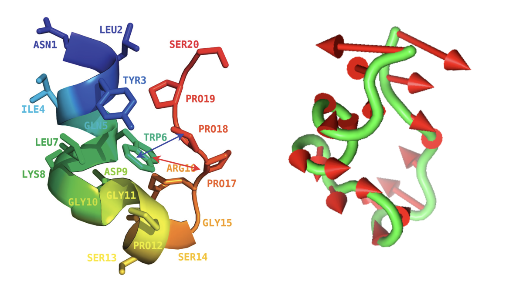
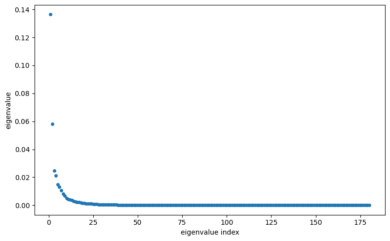
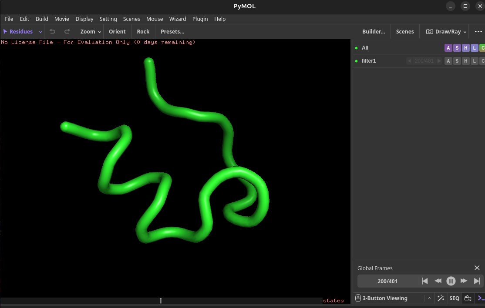
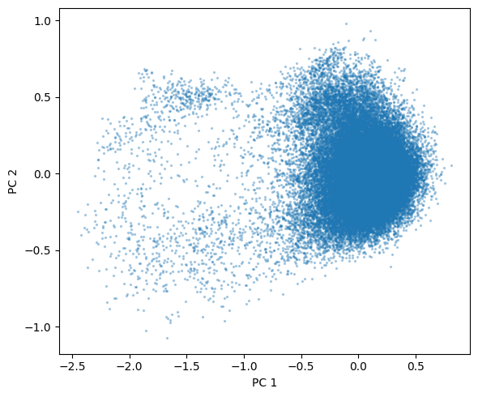
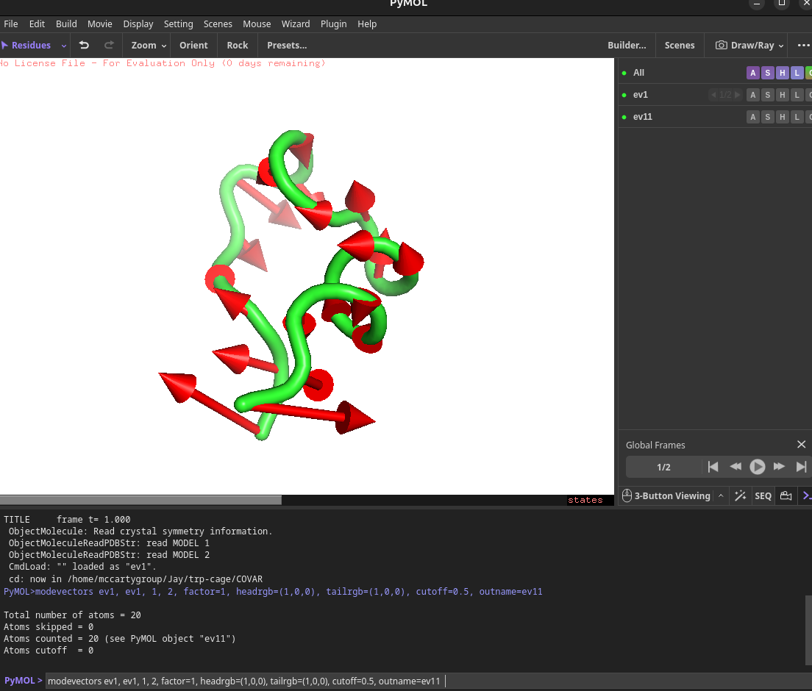

## Analysis of Trp-Cage protein with Principal Component Analysis (PCA)

In this tutorial you will learn how to analyze the dyanamics of a small protein: [trp-cage](https://www.rcsb.org/structure/1L2Y). Although a protein's function is often linked to its conformational dynamics, it is not always obvious how to extract relevant motions from a simulated trajectory. One reason for this is that all the atoms are wiggling and jiggling at the same time and it is not straightforward to distinguish between slow, collective motions and fast, local fluctuations. A princial component analysis (PCA) can help to filter global, collective (often slow) motions from local, fast motions. 

Once this tutorial is completed students will be able to:

- Perform PCA analysis using GROMACS post-processing tools.
- Filter the trajectory along one of the slow, collective modes. 
- Project the protein configurational space onto the sub-space spanned by the first two eigenvectors.
- Create a "porcupine" plot used to illustrate the direction and magnitude of a protein's slow atomic movements

Files Files to complete this tutorial can be accessed here: [tutorial files](coming soon)

These files are already located on bigzam: /opt/workshop/trp-cage/

### Getting Started

Use PuTTY to connect to bigzam using your workshop username and password as you have done in previous tutorials. 

Important: Once connected to the workshop computer, set your environment variables by typing:


source setup.sh 


Copy the tutorial files by typing in the terminal:


cp -r /opt/workshop/trp-cage ~/


This will copy the necessary tutorial files to your home directory on bigzam. Move into the trp-cage directory:


cd ~/trp-cage


In this tutorial, you work with a pre-calculated trajectory to save time. However, all the input files needed to the generate the trajectory are provided with this tutorial. (If you want extra practice preparing a GROMACS simulation, you can repeat the steps from the [mini-protein tutorial](../mini-protein/mini-protein_tutorial.md) to generate a trajectory for trp-cage). The trajectory file that you will work with is called `long-production.xtc` and contains a 400 ns trajectory of the trp-cage protein in water. 

### Fix Broken Molecules by Correcting for Periodic Boundary Conditions 

Before analyzing any trajectory, you need to fix molecules that may be broken by the periodic boundary conditions ([See mini-protein tutorial](../mini-protein/mini-protein_tutorial.md])). To do this, you can use the `trjconv` command in GROMACS. In the terminal, type:


gmx trjconv -f long-production.xtc -s long-production.tpr -o long-production_whole.xtc -pbc whole -ur compact
 

when prompted, select Group 1 for Protein. Now, create a reference pdb file by typing:


gmx trjconv -f long-production.xtc -s long-production.tpr -o trp-cage-reference.pdb -pbc whole -ur compact -dump 0


Again, select Group 1 for Protein. You should now have a protein trajectory file called `long-production_whole.xtc` and a reference pdb file called `trp-cage-reference.pdb`. You are now ready to move on with PCA analysis.

### Principal Component Analysis

A very common analysis method is to extract the “principal” or “essential” motions that have the largest amplitudes and involve the largest parts of the structure. Principal component analysis (PCA) of the trajectory, which is sometimes also referred to as ‘essential dynamics’ (ED), aims at identifying large scale collective motions of atoms and thus reveal the structures underlying the atomic fluctuations. The fluctuations of particles are correlated due to coupled interactions between particles. The degree of correlation will vary and notably particles which are directly connected through bonds or lie in the vicinity of each other will move in a concerted manner. The correlations between the motions of the particles give rise to collective motions in the system that is often directly related to its function or (bio)physical properties. The study of the structure of the atomic fluctuations can give valuable insight in the behavior of a macromolecule.

The first step in PCA is the construction of the covariance matrix, which captures the degree of collinearity of atomic motions for each pair of atoms. This matrix is subsequently diagonalized, yielding a matrix of eigenvectors and a diagonal matrix of eigenvalues. Each of the eigenvectors describes a collective motion of particles, where the components of the vector indicate how much the corresponding atom participates in the motion. The associated eigenvalue is a measure of the total motility associated with an eigenvector. Usually most of the motion in the system (>90%) is described by less than 10 eigenvectors or principal components. Since the covariance analysis produces a lot of files, the analysis is best performed in a subdirectory below the directory of the MD run:


mkdir COVAR

cd COVAR


The program `covar` will construct the covariance matrix and perform the diagonalization. Type the following command:


gmx covar -s ../trp-cage-reference.pdb -f ../long-production_whole.xtc -o eigenvalues.xvg -v eigenvectors.trr -xvg none


After entering this command, you will be prompted twice. The first prompt will ask you to choose a group for the least squares fit. Choose Group 4 for Backbone. This will perform a least-squares fit of each from of the trajectory to remove the center of mass motion and rotational tumbling of the protein. 

A second prompt will ask you to choose a group for the covariance analysis. Again, select Group 4 for Backbone. The eigenvectors corresponding to the largest eigenvalues are called "principal components." They represent the largest amplitude of collective motions. The eigenvalues give the variance along the principal component, i.e. the contribution of each principal component to the overall fluctuation of the protein. 

If you issue the command:


ls 


you will see that the `gmx covar` has generated both eigenvalues and eigenvectors in files called `eigenvalues.xvg` and `eigenvectors.trr`. Recall that the eigenvalues indicate the contributions of the eigenvector to the mean square fluctuations. The eigenvalues are sorted according to size. View the first ten eigenvalues by typing:


head eigenvalues.xvg 


You will see something like:

         1 0.136405
         2 0.0582073
         3 0.0247107
         4 0.0211923
         5 0.014929
         6 0.0130243
         7 0.010675
         8 0.00836928
         9 0.0066959
        10 0.00506618


Use the WinSCP app on your windows machine to transfer the eigenvalues.xvg file to your local Windows machine. Then plot with your favorite plotting software. Here is a Python script that will plot the eigenvalues:

[Eigenvalue Plotting](https://colab.research.google.com/drive/1UbHcRROpwItAD9jarD1-U2byuluPFmzf?usp=sharing)

As you can see, there are only a few large eigenvalues, all other are relatively small, suggesting that a large fraction of the total motion is explained by only a few principal components.     
 
To see what type of mtion the individual eigenvectors correspond to, we filter the original trajectory and project the coordinates onto a selected eigenvector. For example, to project the coordinates onto the first (principal) component, type:


gmx anaeig -s ../trp-cage-reference.pdb -f ../long-production_whole.xtc -filt filter1.pdb -v eigenvectors.trr -eig eigenvalues.xvg -first 1 -last 1 -skip 100


Select the index group that was used for the least squares fit. This is Group 4 (Backbone). Answer 4 twice when asked for a group. The output pdb file `filter1.pdb` will show the animation of the dynamics along the first principal component. To view this movie, copy the `filter1.pdb` file to your local Windows machine using the WinSCP app and open the file with PyMOL. Note that the pdb file will only contain the Backbone atoms (no side chain atoms) because this is the group we selected. To see the movie slower you can set in the PyMOL toolbar: Movie --> Frame Rate --> 5 FPS. 

 

As you can see, the animation is still kind of jerky. This is because the motion is not smooth, but due to random fluctuations. To see a smooth animation of the motion along the first principal component, we can artificially interpolate between the two extreme conformations along this eigenvector. Try typing:


gmx anaeig -s ../trp-cage-reference.pdb -f ../long-production_whole.xtc -extr extreme1.pdb -v eigenvectors.trr -eig eigenvalues.xvg -first 1 -last 1 -nframes 30


Again, select Group 4 when prompted. The output pdb file will be `extreme1.pdb`. Try copying this file to your local Windows machine and visualzing this pdb file in PyMOL. 

Now repeat the last command for the second eigenvector:

 
gmx anaeig -s ../trp-cage-reference.pdb -f ../long-production_whole.xtc -extr extreme2.pdb -v eigenvectors.trr -eig eigenvalues.xvg -first 2 -last 2 -nframes 30


And visualize the `extreme2.pdb` file in PyMol as you did before. How would you describe the motion along the first and second eigenvalues? To contrast with a higher eigenvalue, repeat the above procedure for eigenvector 20 (or 50, or any other number of your choice). 
### Two dimensional projection of the configuration space

One way to visualize the sampled conformational space is to plot the subspace spanned by the first two principal components. This is a so-called two-dimensional projections. Along the x-axis we plot the first principal component, which is the direction of largest covariance, and on the y-axis, we plot the second principal component. In this plot, each point represents a snapshot from the simulation, and the distribution of points shows the sampled region along the first two eigenvectors. 

To generate a 2-D projection along the first two eigenvectors, type:


gmx anaeig -s ../trp-cage-reference.pdb -f ../long-production_whole.xtc -v eigenvectors.trr -eig eigenvalues.xvg -2d -first 1 -last 2 -xvg none 


To plot the resulting `2dproj.xvg`, transfer this file to your local Windows machine and use the following Python script:

[plot_2D_surface](https://colab.research.google.com/drive/1hLRIrq_dy1-P6hCe5Lx4YjcPY4jjy7qZ?usp=sharing)

## Making Porcupine Plot

A porcupine plot is a convenient way to visualize the principal motion in a single image. To do this, you can generate another pdb file with two frames representing the two extremes along the PC 1 axis:


gmx anaeig -s ../trp-cage-reference.pdb -f ../long-production_whole.xtc -v eigenvectors.trr -eig eigenvalues.xvg -extr ev1.pdb -first 1 -last 1


Now, transfer the output `ev1.pdb` file to your local Windows machine using WinSCP and load this pdb file into PyMOL. You should see movie toggle between only two frames. 

The python script [modevectors.py](https://github.com/jamesmccarty/modevectors/blob/master/modevectors.py) will allow us to plot the vectors representing the molecular motion. You will need to download this file [here](https://drive.google.com/file/d/1Zdz3Fr-NsVw_P4CYSHwUyX4mfPgT72Hw/view?usp=sharing) to you local Windows machine. Once downloaded, withinn PyMOL, select from the top menu: File --> Run Script ... and find and upload the `modevectors.py` script that you downloaded.

In the PyMOL consol type:

modevectors ev1, ev1, 1, 2, factor=1, headrgb=(1,0,0), tailrgb=(1,0,0), cutoff=0.5, outname=ev11

  
This will generate a porcupine plot such as the one shown here:

Congratulations you have now completed this tutorial. It is suggested now to move on to the [Brief Introduction to PLUMED Syntax and Making Histograms tutorial](../intro_plumed_syntax/analysis.md)

[Return to Day 1 homepage](../../day1.md)

## Optional Extension

Coming soon ... 

