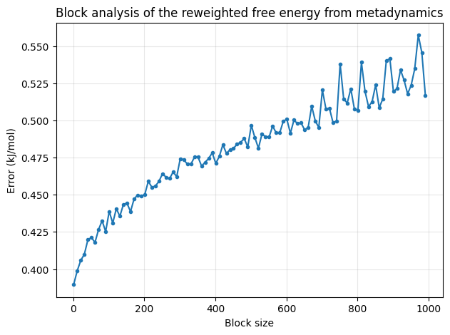
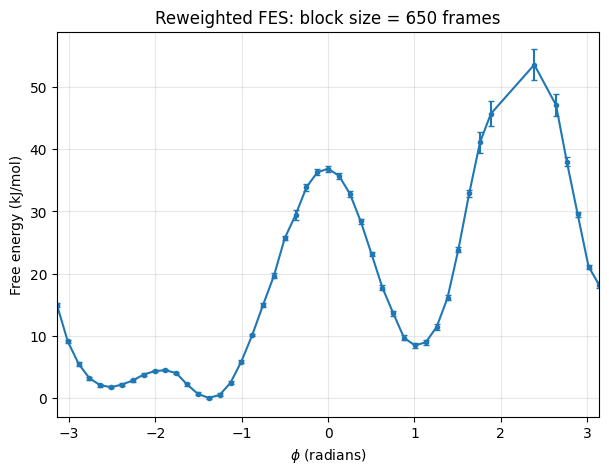
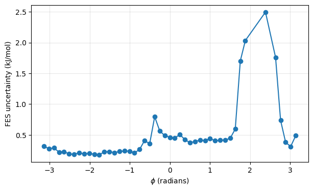

# Error Analysis and Quantifying Uncertainty from MD simulations

By now you know how to measure observables from an MD trajectory using PLUMED and and how to plot a histogram of observable that represents the probability distribution of that given observable (see Tutorial on [A Brief Introduction to PLUMED Syntax and Making Histograms](../../day1/intro_plumed_syntax/analysis.md)). Also, we have seen how to perform a metadynamics simulation to enhance the sampling of configuration space and how to calculate the reweighted free energy surface along a chosen order parameter (see Tutorial on [Metadynamics](../metadynamics/metadynamics.md)). In this tutorial, we now attempt to quantify how we know what we observe from an MD simulation trajectory is **statistically meaningful**? 

Once this tutorial is completed students will be able to:

- Use bootstrapping to estimate the uncertainty and confidence intervals from computed histograms from an MD simulation.
- Compare distributions measured from separate independent MD simulations to see if the two trajectories are sampling the same distribution. 
- Perform a block-analysis to calculate error bars on the free energy surface claculated from a metadynamics trajectory. 

**Files**
Files to complete this tutorial can be accessed here:
[tutorial files](coming soon)

Because we are analyzing trajectories, you not need bigzam for this tutorial. This tutorial will be completed using Python notebooks. 

## Estimating uncertainty from a MD trajectory

In this first example, I have run a 1-$$\mu$$s MD simulation trajectory of the RC9 peptide, GGKGMGFGL, shown here:

The file `RC9_distance.dat` contains the distance between atom HA1 on Gly1 and atom HN on Leu9. For transparency, I created this data using the PLUMED driver with the following input:

<strong> example PLUMED input for reference <code></code></strong>

<pre style="background-color:transparent; border:none; margin-bottom:0;"><code>
d1: DISTANCE ATOMS=6,98 # distance between atom HA1 on Gly1 and HN on Leu9

PRINT ARG=d1 STRIDE=80 FILE=distance.dat
</code></pre>

  

This data is provided for download [here](https://drive.google.com/file/d/1j48wvCrlDujbNO4fM-r1iEl4w4065Agx/view?usp=sharing). Use this link to download the data file to your Windows machine. 

Next, we will use Python to generate a histogram with error bars. Upload your data file `distance.dat` to the [Colab code here](https://colab.research.google.com/drive/10qtu-z5JoIigB5oEkyZfaieOSw37oupp?usp=sharing)

The beginning of this document is similar to what you have done before in earlier tutorials. First you upload your data file and store each column as an array:

Then we calculate the mean and standard deviation as follows:

<strong> Example Python code <code></code></strong>

<pre style="background-color:transparent; border:none; margin-bottom:0;"><code>
d_mean_value = np.mean(d)
d_std_value = np.std(d)
</code></pre>

  

What is the value of the mean distance between HA1 and HN in our simulation?

As before we plot the distance as a function of time across the 1-$$\mu$$s MD simulation (left) and the histogram of that distance (right):

The histogram gives an estimate of the underlying **probability distribution** of the distance. However, becauese the MD simulation contains only a finite number of frames, the histogram itself is subject to statistical uncertainty. Suppose we wanted to quantify the uncertainty of the height of each bar in the above histogram. How could we do this? 

One way to answer this question is through **bootstrap analysis**. [Bootstrapping](https://en.wikipedia.org/wiki/Bootstrapping_(statistics) is a technique widely used in statistics for estimating the uncertainty of a distribution. Bootstrapping estimates the uncertainty by repeatedly generating new datasets from the original trajectory. The basic idea is simple:

- Randomly select frames from our original trajectory **with replacement** until a new dataset containing the same number of frames has been created.
- Compute the histogram for this new dataset
- Repeat this process many times (typicaly hundreds or thousands of times).
- Use the variation among these histograms to estimate a confidence interval for the probability distribution. 

The advantage of this approach is that we do not make any assumptions about the probabily distribution that generated our original data set. 

A simple four lines of Python code will perform the bootstrapping analysis:

<strong> Example Python code <code></code></strong>

<pre style="background-color:transparent; border:none; margin-bottom:0;"><code>
for i in range(n_bootstrap):
    sample = rng.choice(d, size=n, replace=True) # sampling with replacement
    boot_hist[i], _ = np.histogram(sample, bins=bins, density=False) # generating new histogram 
    boot_hist[i] = boot_hist[i] / np.sum(boot_hist[i]) # normalize 

# confidence intervals (95% interval lies between the 2.5th percentile and 97.5th percentile)
lower, upper = np.percentile(boot_hist, [2.5, 97.5], axis=0)
</code></pre>

  

In the Colab notebook provided, we choose 1000 bootstrap samples. Note that because each bootstrap sample is drawn from the original trajectory with replacement, some frames will randomly be chosen multiple times, while others may not be chosen at all. Repeating the resampling proceedure many times allows us to estimate how much the histogram would vary if we repeated the MD simulation under similar conditions. 

Use the Colab notebook to plot the distance distribution with a 95% confidence interval for the distance distribution as a shaded region:

**Main idea**: If you were to repeat the MD simulation 100 times under the same conditions, generating 100 similar distance distributions. The shaded region shows the range where you would expect the histogram from 95 of those simulations to lie.  
 
# Comparing histograms from independent MD simulations 

Because the equations of motion that generate a molecular dynamics trajectory are nonlinear, two simulations started from the same initial state but with different random initial velocities will diverge and follow different trajectories. If each simulation is sufficiently long and **samples the same equilibrium ensemble**, the distributions of observables (such as interatomic distances) should be statistically indistinguishable, even though the individual trajectories are different.  

For this reason, it is good practice to perform multiple independent MD simulations using different randomized initial velocies. These independent replicas provide a way to assess the **reproducibility** of the simulation results and determine if the sampled distributions are consistent with one another. 

A second common application is to **compare simulations performed under different conditions**. For example, you may wish to compare a wild-type protein with a mutant, compare a reaction under different environmental conditions, or compare ligand binding with a functional group modification. In these cases, the goal is to determine whether the underlying probability distribution of some observable has changed in a statistically meaningful way.    

In this tutorial, we will use the **Kolmogorov-Smirnov (KS) test** to compare distance distributions from three independent simulations. The KS test provides an objective measure of whether the two datasets are consistent with having been drawn from the same underlying probability distribution. 

We will again use the RC9 peptide from the previous example as our model system. I have performed three independent 1 $$\mu$$s MD simulations of the peptide. Two of the simulations were run under identical conditions, and therefore should produce statistically indistinguishable distance distributions. However, in the the third MD simulation, I implemented a harmonic restraint applied to the peptide end-to-end distance, altering the conformational sampling. 

Our goal is to determine whether we can identify the restrained simulation based solely on the distance distributions. Rather than visualzing the histograms, we will use the KS test to determine whether the observed differences are statistically significant. 

## The KS test

Instead of comparing two histograms directly, the KS test compares the **cumulative distribution functions (CDFs)** of two datasets. The cumulative distribution is the probability that an observable is less than or equal to a given value. The KS statistic, $$D$$, is simply the **largest vertical distance** between two cumulative distribution functions as shown in the figure below:

Conceptually, we can understand that if two distrivutions are identical, their CDFs will overlap and $$D$$ will be small. Very different distributions will have larger separation in the CDF, giving larger values of $$D$$. 

After computing the KS statistic, the test calculates a $$p-value$$. The p-value tells you how likely it would be to observe a distance at least this large by random chance if the two datasets were actually sampled for the same underlying probability distribution. A general rule is that a p-value $$>$$ 0.05 means that we cannot reject the hypothesis that the two simulations sample the same distribution. On the othe hand, a p-value $$ <$$ 0.05 means that the two simulations sample different distributions. 

Performing the KS test is quite easy in Python using the `scipy.stats` library. Here we should use the two-sample Kolmogorov-Smirnov test, [ks_2samp](https://docs.scipy.org/doc/scipy/reference/generated/scipy.stats.ks_2samp.html) since we are comparing two different data sets. If we have two sets of data, `trialA` and `trialB`, we can run the KS test in Python with the lines:

<strong> Example Python code <code></code></strong>

<pre style="background-color:transparent; border:none; margin-bottom:0;"><code>
from scipy.stats import ks_2samp

result = ks_2samp(trialA, trialB)

</code></pre>

 

The result will have two components that we can print, the KS statistic ($$D$$) and the p-value:

<strong> Example Python code <code></code></strong>

<pre style="background-color:transparent; border:none; margin-bottom:0;"><code>
print(result.statistic)
print(result.pvalue)
</code></pre>

 

We can perform this test on any pair of trials to decide if they sample the same distribution or are statistically different. 

In this tutorial, you can find a link to download the three trial datasets here:

[distance_trials.tar.gz](https://drive.google.com/file/d/18J2AnzSspJBqxU-M5GfqNxeIYNOp2xyQ/view?usp=sharing)

Download the compressed archive containing the three trials to your local Windows machine. Then upload your files to the Colab notebook here for running the KS test:

[KS test notebook](https://colab.research.google.com/drive/1GUF6SWx2ibZVbENVv-pmxqOzApnDeAUz?usp=sharing) 

We unzip the archived data files with the line: 

<strong> Example Python code <code></code></strong>

<pre style="background-color:transparent; border:none; margin-bottom:0;"><code>
!tar -xzf distance_trials.tar.gz
</code></pre>

 

Then store the three datasets as `trialA`, `trialB`, and `trialC`. 

Performing the KS test on `trialA` and `trialB` gives the following:

<strong> Example Python output<code></code></strong>

<pre style="background-color:transparent; border:none; margin-bottom:0;"><code>
KS statistic = 0.7463
p-value = 3.6019e-272
</code></pre>

 

Here we see the p-value is much smaller that 0.05 indicating the distributions are statistically different. We can confirm this by plotting the CDFs for the two datasets. Notice that the CDFs hardly overlap and the vertical difference between them is large. 

For comparison, perform the KS test on `trialB` and `trialC` gives a small KS statistic $$D=0.0265$$ and a p-value = 0.8 which is well above 0.05. We conclude that data from `trialB` and data from `trialC` are drawn from the same underlying distribution. This means that averages obtained from these two independent MD simulations should be statistically equivalent. 

Plotting the CDFs for the two trials, we see a large degree of overlap as expected for such a large p-value:

Based on the KS test analysis we should conclude the following: trial B and trial C represent samples drawn from the same underlying distribution; therefore, these trials must be the two identical unrestrained MD simulation samples. On the other hand, trial A is drawn from a different underlying distribution and must correspond to the restrained MD simulation. We conclude that the restraint shifted the underlying distribution of sampled distances.      

In fact we can readily see this just by looking at the histograms of the three trials, where we see that the restraint has shifted the sampled distances to much lower values:

**Key Idea**: The KS test provides an objective way to compare two simulations. Rather than relying on visual inspection of histograms, it quantifies the largest vertical difference between the cumulative distributions and determines whether that difference is statistically significant based on the p-value.
 
## Error bars on free energy surfaces from metadynamics  

In previous tutorials, you calculated reweighted free energy surfaces from metadynamics (or umbrella sampling) simulations. Recall that the free energy surface is estimated from the logarithm of the probability distribution:

$$ F(s) = -RT \ln P(s) $$ 

But the probability distribution (and hence also the free energy) is only an estimate based on the histogram calculated for a finite simulation. Because the histogram is calcualted from finite sampled data there will always be a level of statistical uncertainty that is propagated to free energy profile.  

**Block analysis** provides a simple way to estimate the statistical uncertainty in the calculated free energy profile arising from the finite length of the simulation. Larger statistical uncertainties indicate that additional sampling (loger simulation or enhanced sampling such as metadynamics)  may be required before the free energy profile can be considered well converged.

In the previous [metadynamics tutorial](../metadynamics/metadynamics.md), we introduced the time-dependent reweighting factor (`metad.rbias`), and we used this quantity to calculate the correct statistical weight of each frame that enables us to reweight the biased histogram and obtain the free energy profile. In this exercise, we will see how this information can be used to calculate the error in the reconstructed free energy profile and assess whether our simulation is converged or not.

For this tutorial, I have run a long metadynamics simulation of alanine dipeptide ( N-acetyl-L-alanine-N'-methylamide) biasing both the $$\phi$$ and $$\psi$$ angle, just as you did in the previous [metadynamics tutorial](../metadynamics/metadynamics.md). 

**Note: Feel free to try using your own MD simulation data that you generated from the previous metadynamics tutorial. The data you will need is in the COLVAR file we generated and then analyzed with `plumed_reweight.dat`. You may also choose to use the `COLVAR` file that I have provided here.

The output from the metadynamics simulation is written to the file called [COLVAR](https://drive.google.com/file/d/1-o5N4ePfjtAliITh7hcpBxCL89VKU7Ec/view?usp=sharing). Download this file to your local Windows machine for this tutorial. The contents of this file have the form:

<strong> Example COLVAR file <code></code></strong>

<pre style="background-color:transparent; border:none; margin-bottom:0;"><code>
#! FIELDS time phi psi metad.bias metad.rbias
#! SET min_phi -pi
#! SET max_phi pi
#! SET min_psi -pi
#! SET max_psi pi
 0.000000 -1.498385 0.273949 0.000000 0.000000
 0.500000 -1.284020 1.868616 0.000000 0.000000
 1.000000 -2.074010 2.646855 0.000000 0.000000
 1.500000 -2.215670 2.421693 0.034877 0.032636
 2.000000 -2.412214 -3.134460 0.000000 -0.002241
</code></pre>

 

where the first line tells us the the first column is the time (ps), the second column $$\phi$$ (rad), the third column is $$\psi$$ (rad), the fourth column is the metadyanmics bias, $$V(t)$$ (kJ/mol), and the final column is the time-dependent reweighting factor which is $$V(t) - C(t)$$ where $$C(t)$$ is a time-dependent constant that does not depend on the collective variable. To assign a weight to any frame, $$i$$, in our biased simulation, we simply compute the weight as:

$$w_i = \exp \left(\frac{V_i -C(t_i)}{RT}\right)$$ 

In Python this can be done with the line:

<strong> Example Python code <code></code></strong>

<pre style="background-color:transparent; border:none; margin-bottom:0;"><code>
weights = np.exp(rbias/RT)
</code></pre>

   

Upload your `COLVAR` file to the following Colab notebook that can be used to perform a block analysis:

[Link to Block Analysis Notebook](https://colab.research.google.com/drive/1dqVtUXJHNLynpOjFruLKxJs0Z7Bo-0Es?usp=sharing)

After loading the file, the script will calculate the weight for each frame. If we print the $$\phi$$ value with its corresponding weight, we can inspect the first 10 frames: 

<strong> Example Python code <code></code></strong>

<pre style="background-color:transparent; border:none; margin-bottom:0;"><code>
for i in range(10):
  print(phi[i],weights[i])
</code></pre>

    

Each line contains the value of the dihedral $$\phi$$ along with the corresponding (un-normalized) weight $$w$$ for each frame of the metadynamics trajectory:

<strong> Example Python output <code></code></strong>

<pre style="background-color:transparent; border:none; margin-bottom:0;"><code>
-1.498385 0.029356663080163204
-1.28402 0.029356663080163204
-2.07401 0.029356663080163204
-2.21567 0.029743290271178422
-2.412214 0.029330299888318426
-2.18812 0.02930398386781861
-2.03323 0.04282380424195966
-2.484923 0.04218933745045227
-1.485115 0.02927095481982935
-1.266694 0.029244762392134548
</code></pre>

  

At this point we can apply the block-analysis technique to calculate the average free energy across the blocks and the error as a function of block size. The idea is that instead of treating the entire trajectory data as one long simulation, we divide it into chunck or **blocks** of equal pieces. Each block is treated as though it were an independent simulation and gives an independent estimate of the free energy. 

Finally, we calculate the average error along each free-energy profile as a function of the block size. For your convenience, I have defined a function called `do_block_fes_1d()` that will perform the block analysis. 

We create an array to test block sizes ranging from 1 to 1000:

<strong> Example Python code <code></code></strong>

<pre style="background-color:transparent; border:none; margin-bottom:0;"><code>
block_sizes = np.arange(1, 1001, 10)
</code></pre>

  

After running the block analysis, we can plot the average error along each free-energy profile as a function of the block size:

In the plot of the average error as a function of block size we see an initial rapid increase in the estimated error between block sizes of 0 to 201 frames. This is the regime where block sizes are too small, and correlations within the trajectory are leading to and underestimate of the uncertainty. Ideally, the true uncertainty would be the regime where the error reaches a plateau.

Here, we don't see a true plateau, but the average error begins to increase more slowly at block sizes of approximately 500 frames, while fluctuations in the average error become noticeably larger beyond block sizes of about 700 frames. We therefor want to choose a block size between 500 and 700 frames as a reasonable compromise. 

At small block sizes, the blocks are too short relative to the correlation time so the uncertainty is underestimated. As the block size increases, the block estimates become less correlated and the calculated error approaches a more reliable value. However, at the same time, increasing the block size reduces the total number of blocks available for analysis. With fewer blocks, the error estimate itself becomes noisier. 

Based on this plot, I chose to divide the trajectory into blocks of 650 frames, resulting in 46 approximately independent blocks, to estimate the uncertainty in the free-energy profile. This block size retains a reasonable number of blocks for the statistical analysis and lies within the regime where the average uncertainty is beginning to stabilize.

The free energy profile with error bars from block analysis using block sizes of 650 frames is shown here:

The error bars may appear small here due to the scale of energies on the y axis. A separate uncertainty plot would make this clearer:

Here we see that the low free energy metastable basins have uncertainties below 0.5 kJ/mol. These states have been sampled extensively during the metadynamics simulation, resulting in well-converged free-energy estimates. On the other hand, the uncertainty increases in the higher free energy transition-state regions, reaching values up to 2.5 kJ/mol. These regions are not sampled as frequently in the simulation or are contributing less to the equilibrium ensembe after reweighting, leading to larger statistical uncertainties.

Overall, we can conclude that the major features in the free energy landsacpe are well converged. 

In conclusion, error analysis and assessment of the free energy convergence is an essential part of enhanced sampling calculations, as it provides a measure of confidence in the calculated free-energy surface. 

Congratulations you have compete the workshop tutorials! 

[Return to Day 2 homepage](../../day2.md)
 

~    

