# Metadynamics

In this tutorial you will learn how to perform a metadynamics enhanced sampling simulation using PLUMED. We will use the alanine dipeptide molecule as a simple model system for exploring conformational transitions and free energy calculations.

Once this tutorial is completed students will be able to:

- Define and assess collective variables for enhanced sampling
- Run a metadynamics simulation using PLUMED
- Calculate free energies from a metadynamics simulation
- Perform reweighting of biased frames to construct unbiased histograms

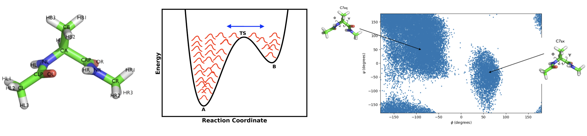

**Files**
Files to complete this tutorial can be accessed here:
[tutorial files](coming soon)

These files are already located on bigzam:
/opt/workshop/metadynamics/

## Getting Started

Use PuTTY to connect to bigzam as you did in previous [tutorials](../../day1/lj_fluid/lj_fluid_tutorial.md). Open PuTTY from the Window Start menu and enter `bigzam.local` for the Host Name. Login using the terminal using your username and password.

**Important**: Once connected to the workshop computer, set your environment variables by typing:


source setup.sh


Copy the tutorial files by typing in the terminal:

In the terminal type:

cp -r /opt/workshop/metadynamics/ ~/


This will copy the necessary tutorial files to your home directory on bigzam.

**Tip**: You can press the Tab key to automatically complete file and directory names. This can save time and help avoid typing errors.

Move into the metadynamics directory:


cd ~/metadynamics


Within this directory you will find the following files:

- dialaA.pdb: A reference PDB structure file of the molecule
- alanine_dipeptide.gro: A GROMACS structure file (.gro)
- topol.top: A GROMACS topology file (.top)
- vacuum.mdp: A GROMACS parameter file (.mdp)

## Metadynamics

In the previous tutorial on [using restraints](../restraints/restraints.md), you learned how to use PLUMED to bias an MD simulation on-the-fly. In this tutorial we will use metadynamics to accelerate the sampling and reconstruct the unbiased free energy surface. Here you can find a brief recap of the metadynamics theory. 

In metadynamics, a history-dependent bias potential is constructed on-the-fly acting on a few selected degrees of freedom $$s$$, generally called collective variables (CVs). This bias potential is built as a sum of Gaussian kernels deposited along the trajectory in the CVs space:

$$V(s,t)=\sum_{t' <t} W(t') \text{exp}\left[-\frac{(s-s(t'))^2}{2\sigma^2} \right]$$

where $$s$$ is the collective variable being biased, $$W$$ is the Gaussian height, and $$\sigma$$ the Gaussian width. As the metadynamics bias grows, the effect is to push the system away from local minima into visiting new regions of the phase space. 

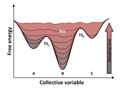

In the well-tempered version of metadynamics, the hill height $$W(t)$$ decreases as the bias accumulates:

$$W(t) = w_0 \text{exp}\left[ -\frac{V(s,t)}{k_B \Delta T}\right]$$

where $$w_0$$ is the initial hill height, $$V(s,t)$$ is the accumulated bias, and $$\Delta T$$ is a temperature parameter that is specified to regulate the extent of free-energy exploration. Rather than specifying $$\Delta T$$, metadynamics in PLUMED asks for the so-called **biasfactor**: 

$$ \gamma = \frac{T+\Delta T}{T} $$ 

or equivalently:

$$ \Delta T = (\gamma - 1)T $$ 

Setting $$\gamma = 1$$ is equivalent to no bias (standarnd MD), and increasing the value of $$\gamma$$ leads to stronger exploration of the CV space. 

As the Gaussian kernels continue to be deposited the rugged free energy landscape is filled, and the deposited bias approaches a scaled version of the free-energy surface: 

$$ V(s) \rightarrow -\frac{\gamma -1}{\gamma}F(s) +C $$ 

where $$C$$ is an arbitrary (time-dependent) constant. Rearranging gives a theoretical estimate for the free energy surface, related to the negative of the accumulated bias:

$$ F(s) \approx -\frac{\gamma }{\gamma -1 }V(s) + C$$  

## Bias along a single coordinate

In this exercise we will setup and perform a well-tempered metadynamics run using the backbone dihedral $$\phi$$ as collective variable. During the calculation, we will also monitor the behavior of the other backbone dihedral $$\psi$$.

In the workshop directory  you can find a sample PLUMED input called `plumed_metad_phi.dat` that you can use as a template. Whenever you see an highlighted `__FILL__` string, this is a string that you must replace.

Have a look at the contents of `plumed_metad_phi.dat` with:


nano plumed_metad1.dat


The first several lines define the collective variables $$\phi$$ and $$\psi$$. 
For help defining the $$\phi$$ and $$\psi$$ angles, you might need to refer back to the previous tutorial on [Introduction to PLUMED syntax](../../day1/intro_plumed_syntax/analysis.md).


MOLINFO STRUCTURE=dialaA.pdb
# Compute the backbone dihedral angle phi, defined by atoms C-N-CA-C
# you might want to use MOLINFO shortcuts
phi: TORSION ATOMS=__FILL__
# Compute the backbone dihedral angle psi, defined by atoms N-CA-C-N
# here also you might want to use MOLINFO shortcuts
psi: TORSION ATOMS=__FILL__


The next lines initiate metadynamics with the [METAD](https://www.plumed.org/doc-v2.9/user-doc/html/_m_e_t_a_d.html) action. Read this section carefully; it is important to understand what each of these input options means.


# Activate well-tempered metadynamics in phi
metad: METAD ...
    ARG=phi
   # Deposit a Gaussian every 500 time steps
    PACE=__FILL__ 
    # set initial Gaussian height equal to 1.2 kJ/mol  
    HEIGHT=__FILL__
     # set Gaussian width (sigma)
    SIGMA=0.1
    # The bias factor should be wisely chosen 
    BIASFACTOR=8
   # Gaussians will be written to HILLS file and stored on grid 
   FILE=HILLS GRID_MIN=-pi GRID_MAX=pi
...


The above lines tell PLUMED that we will run metadyanics on the $$\phi$$ angle. The `PACE` sets the Gaussian deposition rate (how frequently a new Gaussian is deposited). Set this to `PACE=500`, meaning we will add a new Gaussian every 500 MD steps. The `SIGMA` and `HEIGHT` section specify the Gaussian width and height, respectively. The units here for `SIGMA` will be in radians (since $$\phi$$ is in radians) and for `HEIGHT` is in energy units (kJ/mol). In this example, set `SIGMA=0.1` radians and `HEIGHT=1.2` kJ/mol. The `BIASFACTOR` dictates the level of sampling. In so-called **well-tempered metadynamics** the biasfactor determines the rescaling of the initial Gaussian height so that the bias potential smoothly converges to a fixed level in the long time limit. 

A good rule of thumb is that the `BIASFACTOR` should be large enough to accelerate barrier crossing, but not so large that you overfill the free energy landscape or require prohibitively long convergence times. `BIASFACTOR=10` is usually a  good starting point. A useful way to think about the BIASFACTOR is in terms of the free energy barrier height you expect ($$\Delta G^{\dagger}$$). Suppose your free energy barrier is about $$\Delta G^{\dagger} = 10 RT$$. With a biasfactor = 10, the effective barrier becomes $$\sim 1 RT$$, making transitions frequent while still allowing the bias to converge smoothly. 

It is computationally more efficient to use a grid to store the accumulated bias. The following lines within the METAD action tell PLUMED to store the Gaussian bias kernels in a file called `HILLS` that will be constructed on a grid with range $$-\pi$$ to $$\pi$$. 


FILE=HILLS GRID_MIN=-pi GRID_MAX=pi


Finally, we print everything to the file `COLVAR_phi` with the PRINT action. 


PRINT ARG=phi,psi,metad.bias FILE=COLVAR_phi STRIDE=100
 

**Important**: When running a metadynamics simulation, don't forget to PRINT the metadynamics bias (metad.bias) because you will need this for post-processing.

Once your `plumed_metad_phi.dat` file is complete, you can run a metadynamics simulations with the following command:


gmx grompp -f vacuum.mdp -c alanine_dipeptide.gro -p topol.top -o metad_run1.tp



gmx mdrun -v -deffnm metad_run1 -plumed plumed_metad_phi.dat -nt 1


When this job finishes, you will have produced a `HILLS` file along with a `COLVAR_phi` file. The `HILLS` file contains each of the Gaussian bias kernels that were deposited during the simulation. To get a quick estimate of the free energy surface as a function of the $$\phi$$ angle, you can use the PLUMED utility `sum_hills`, which sums the Gaussian kernels deposited during the simulation and stored in the `HILLS` file. Here, it is sufficient to type the following command line:


plumed sum_hills --hils HILLS 
 

The command above generates a file called `fes.dat` in which the free-energy surface as function of $$\phi$$ is calculated on a regular grid based on the sum of Gaussian hills that were added. 

## Analyzing Results

First, let's look at the output `COLVAR_phi` and `fes.dat` file from your metadynamics simulation. Use the WinSCP app to transfer these files from bigzam to your local Windows machine. Use the following Google Colab to upload and plot these files:

[Plotting results](https://colab.research.google.com/drive/13Ql_sJOa80ZDo5eNu-TFWCZaABRP_w-Q?usp=sharing)

The contents of the `COLVAR_phi` file are:


#! FIELDS time phi psi metad.bias
 0.000000 -1.498385 0.273949 0.000000
 0.200000 -1.181761 0.833923 0.000000
 0.400000 -1.536486 2.057503 0.000000
 0.600000 -1.632213 2.782492 0.000000
 0.800000 -1.854007 2.674607 0.000000


Plotting the first two columns shows $$\phi$$ vs. time over the course of the metadynamics simulation:

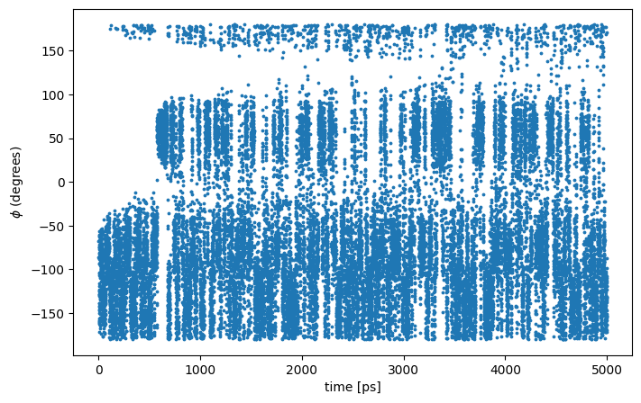

The above plot shows  let's how $\phi$ evolves during the metadynamics simulation. We see that the system is initialized in one of the two metastable states of alanine dipeptide. After a while (t = 500 ps), the system is pushed by the metadynamics bias potential to visit the other local minimum. As the simulation continues, the bias potential fills the underlying free-energy landscape, and the system is able to diffuse in the entire conformational space.

If we look at the 2-D Ramachandran we see that the simulation sampled both the C7eq to the C7ax states:

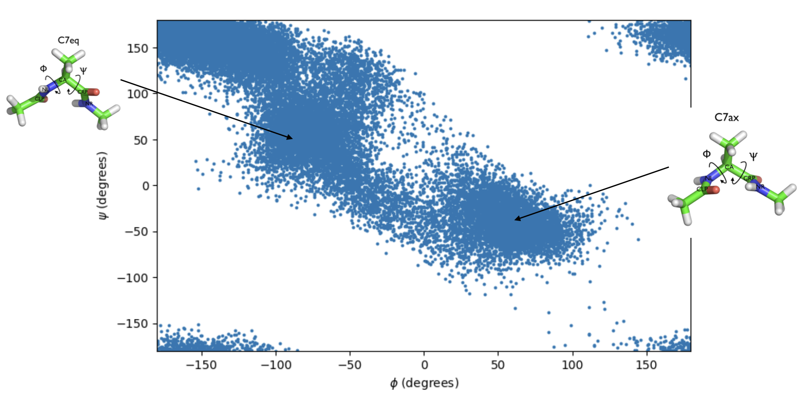

Finally, let's look at a plot of the `fes.dat` file. This gives an estimate of the free energy as a function of the dihedral $$\phi$$. 

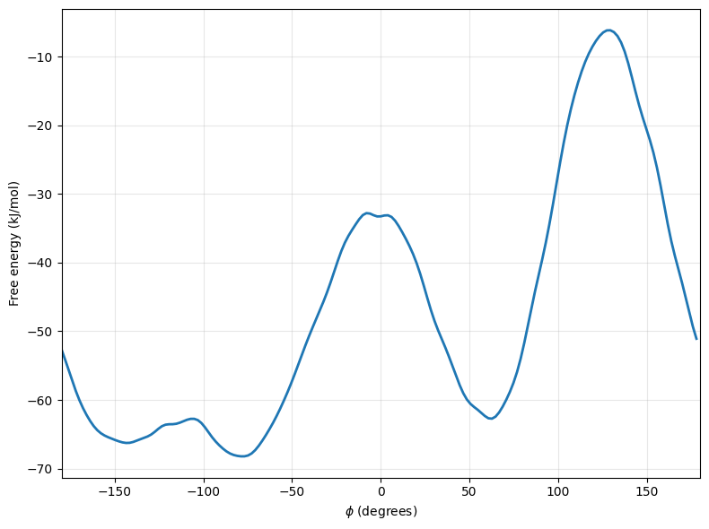

**Note**: the free energy from `sum_hills` is defined only up to an irrelevant constant, so the entire curve could be shifted up or down without physical consequence (for example, if we wanted to set the minimum to zero, then the free energy would be defined relative to the most stable ground state).  

## Assessing Convergence

To give a preliminary assessment of the convergence of a metadynamics simulation, one can calculate the estimate of the free energy as a function of simulation time. At convergence, the reconstructed profiles should be similar. The `sum_hills` option --stride should be used to give an estimate of the free energy every N Gaussian kernels deposited, and the option --mintozero can be used to align the profiles by setting the global minimum to zero for each case. Use the following command line to generate a series of free energy estimates:


plumed sum_hills --hills HILLS --stride 100 --mintozero


The above command will calculate a free energy estimate every 100 Gaussian kernels deposited, and the global minimum is set to zero in all profiles. 

For easier file transfer, make an Archive of these fes.dat files:


tar -czf fes_files.tar.gz fes*


Now transfer both the `HILLS` file and `fes_files.tar` from bigzam to your local machine using WinSCP. A Google Colab to analyze these files is provided here:

[Analyze convergence](https://colab.research.google.com/drive/1R-afSE8EQxFaaGfpgUBkXXQEbuCTOh-h?usp=sharing)

First, we will look at the contents of the `HILLS` file. Upload this file to the Google Colab document for plotting. The content of the `HILLS` file looks like:


#! FIELDS time phi sigma_phi height biasf
      1.000000047497451     -2.826761701208621                    0.1      1.371428571428571                      8
      2.000000094994903     -2.544430577600947                    0.1      1.369678231037363                      8
      3.000000142492354     -2.624871079432158                    0.1       1.29334497169472                      8
      4.000000189989805     -1.306362263528052                    0.1      1.371428571428571                      8
      5.000000237487257     -1.082306877531441                    0.1       1.36379033894263                      8


The line starting with FIELDS tells us what is displayed in the various columns of the HILLS file. We see that at each time frame we have a Gaussian kernel centered at a specific value of $$\phi$$ (second column) with a specified width (sigma, third column), and height (fourth column). 

A plot of the Gaussian height over the similation time is as follows:

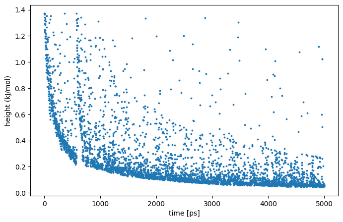

We see that the Gaussian height does indeed decrease during the simulation, according to the well-tempered recipe. The fact that the Gaussian height is decreasing to zero should not be used as a measure of convergence of your metadynamics simulation. It just means that the regions currently being visited have already accumulated substantial bias and the system is not evolving to any new, previously unvisited regions. 

Early in the simulation, the estimated free energy surface is based on limited sampling and may differ substantially from the final result. As the metadynamics simulation progresses and more Gaussian hills are deposited, additional regions of the free energy landscape are explored, leading to a more accurate estimate. A useful way to monitor convergence is to compare free energy surfaces generated throughout the simulation. When successive estimates become nearly identical, the simulation is approaching convergence. The figure below shows an overlay of the free energy surfaces, colored by the number of Gaussian hills that have been deposited.

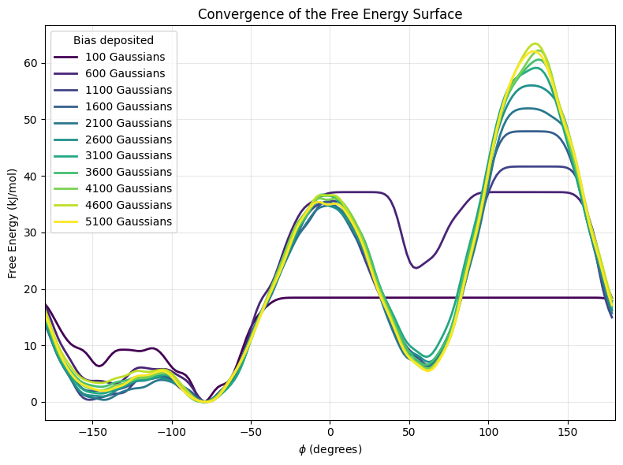

We see in the above, that the free energy estimate is rapidly changing at the beginning of the simulation, but is not changing significantly after about 4100 Gaussians have been added. Combined with our earlier obseration that the $$\phi$$ angle is diffusing rapidly across all angle values, we can be reasonably confident that the simulation has converged. 

## Missing slow degrees of freedom 

Let's investigate what would happen if we had choosen to bias the $$\psi$$ angle instead of the $$\phi$$ angle.  Complete the template `plumed_metad_psi.dat` file similar to the previous exercise to run this calculation, this time setting the `METAD` argument to `ARG=psi`. 

Once your `plumed_metad_psi.dat` file is complete, run a metadynamics simulation with the following command:


gmx grompp -f vacuum.mdp -c alanine_dipeptide.gro -p topol.top -o metad_run2.tpr

gmx mdrun -v -deffnm metad_run2 -plumed plumed_metad_psi.dat
  

When the job finishes, the output file will be `COLVAR_psi`. As you did earlier, transfer this file to your local Windows machine using WinSCP and plot the behavior of the CV during the simulation using the [Colab here](https://colab.research.google.com/drive/1zA_lNQPlknAXWwefqT6jc9Nm9-GoZTJv?usp=sharing). Here we will plot at the same time the evolution of the metadynamics CV $$\psi$$ and of the other dihedral $$\psi$$. 

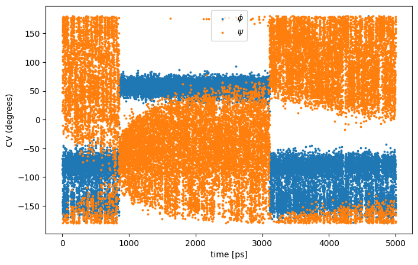

Notice that something different happened compared to the previous metadynamics simulation where you biased the $$\phi$$ angle. At first the behavior of $$\psi$$ looks diffusive in the angle range; however, around t=1000 ps, $$\psi$$ seems trapped at a value at which it was previously diffusing without problems. The reason is that the non-biased CV $$\phi$$ after a while has jumped into a different local minima. Since $$\phi$$ is not directly biased, one has to wait for this (slow) degree of freedom to equilibrate before the free energy along $$\psi$$ can converge.

(Optional): Try repeating the analysis done previously and calcualte the estimate of the free energy as a function of time to assess the convergence of this metadynamics simulation. 

## Metadyanmics on two CVs and Reweighting

The PLUMED input example, `plumed_metad_phi_psi.dat` will run a metadynamics simulation on both the $$\phi$$ and $$\psi$$ angles simultaneously. Including both angles as collective variables should promote transitions between the major conformational basins and allow the simulation to explore the Ramachandran free energy landscape more completely than when either angle is biased alone.

First, have a look at the `plumed_metad_phi_psi.dat` file and make sure you understand each section:


cat plumed_metad_phi_psi.dat



# Activate MOLINFO functionalities
MOLINFO STRUCTURE=dialaA.pdb 
# Compute the backbone dihedral angle phi, defined by atoms C-N-CA-C
# you might want to use MOLINFO shortcuts
phi: TORSION ATOMS=@phi-2
# Compute the backbone dihedral angle psi, defined by atoms N-CA-C-N
# here also you might want to use MOLINFO shortcuts
psi: TORSION ATOMS=@psi-2 

# Activate well-tempered metadynamics in phi
metad: METAD ...
    ARG=phi,psi
   # Deposit a Gaussian every 500 time steps
    PACE=500
    # set initial Gaussian height equal to 1.2 kJ/mol  
    HEIGHT=1.2
     # set Gaussian width (sigma)
    SIGMA=0.1,0.1 
    # The bias factor should be wisely chosen 
    BIASFACTOR=8 
   # Gaussians will be written to HILLS file and stored on grid 
   FILE=HILLS GRID_MIN=-pi,-pi GRID_MAX=pi,pi
   CALC_RCT # Added reweighting factor calculation here!!
   TEMP=300
...

# Print both collective variables on COLVAR file every 10 steps
PRINT ARG=phi,psi,metad.bias,metad.rbias FILE=COLVAR STRIDE=100


This file looks very similar to our previous ones except that in the METAD section we include both phi and psi as arguments with `ARG=phi,psi` (no spaces between commas in PLUMED), and we include a SIGMA value for each and the HILLS file will be on a 2D grid.  

**Important**: Notice that the METAD action includes the `CALC_RCT` flag. This instructs PLUMED to calculate a weight factor that can be used for reweighting a well-tempered metadynamics trajectory by accounting for the added bias in our probability distrubtions. With this option enabled, PLUMED stores the weight as `metad.rbias`, which must also be printed to the output `COLVAR` file using the `PRINT` action. This quantity `metad.rbias` will be used for post-processing our biased trajectory to reconstruct unbiased histograms and free energy surfaces.

After inspecting the input file, run the metadynamics simulation as:


gmx grompp -f vacuum.mdp -c alanine_dipeptide.gro -p topol.top -o metad_run3.tpr

gmx mdrun -v -deffnm metad_run3 -plumed plumed_metad_phi_psi.dat -nsteps 7500000


Here I have extended the number of MD steps to run to 7500000. Because both the $$\phi$$ and $$\psi$$ dihedral angles are biased simultaneously, the simulation must explore a larger conformational space than in the one-dimensional example, and therefore requires more sampling to approach convergence. This simulation should take a few minutes to complete.   

The output files will be called `COLVAR` containing the information about the $$\phi$$ and $$\psi$$ values and `HILLS` containing information about the Gaussian hills deposited. 

Let's assess the sampling by looking at a 2D-Ramachandran plot. Transfer the `COLVAR` file to your local machine and upload [here for plotting](https://colab.research.google.com/drive/17dmn4k9-aLvbhGTfkUURj5WsVZNU0S8E?usp=sharing).

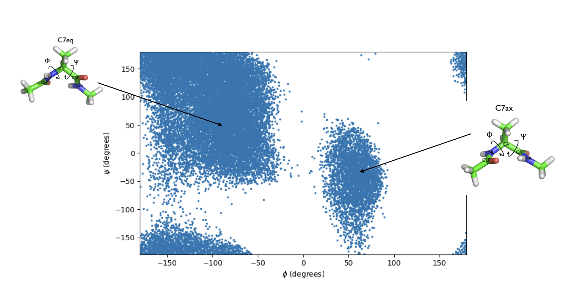

Here we see that we have sampled extensively the C7eq and C7ax states but relatively infrequently the transition states between them. 

### Reweighting

In the previous exercise where we biased only $$\phi$$, we computed the free energy as a function of the same variable directly from the sum of Gaussian kernels using the `sum_hills` utility. Now, when we run metadynamics on both $$\phi$$ and $$\psi$$ simultaneously, the total bias is a sum of two-dimensional Gaussians centered on pairs of $$\phi$$,$$\psi$$ values. 
  
Additionally, in many cases you might decide that the variable you would like to analyze after having performed a metadynamics simulation is not the same variable as the one that was biased. 

Earlier, when we analyzed a standard MD simulation in GROMACS (without metadynamics) you simply calculated histograms of these variables directly from your trajectory. Now, however, the presence of the metadynamics bias potential has altered the statistical weight of each frame, so we can't just calculate the histogram from the MD trajectory as before. To remove the effect of this bias (and thus be able to calculate properties of the system in the unbiased ensemble), you must reweight (unbias) your simulation. 

There are several ways to calculate the correct statistical weight of each frame in your metadynamics trajectory and thus to reweight your simulation. In this exercise we will use the time-dependent estimator of [Tiwary](https://pubs.acs.org/doi/10.1021/jp504920s) by using the `metad.rbias` column in the output `COLVAR` file. 

Instead of using Python, we will calculate the histogram and corresponding free energy surface directly in PLUMED. To do this, we will use a new PLUMED input file, called `plumed_reweight.dat`. 

The `plumed_reweight.dat` file looks like this:


# Read the variable we want to reweight from the COLVAR file
rphi: READ FILE=COLVAR VALUES=phi IGNORE_TIME 
rpsi: READ FILE=COLVAR VALUES=psi IGNORE_TIME

# Also read the metad.bias and metad.rbias column from the COLVAR file
metad: READ FILE=COLVAR VALUES=metad.* IGNORE_TIME

# Use the rbias reweighting factor to get the weights for each frame
weights: REWEIGHT_METAD ARG=metad.rbias TEMP=300

# Now we can use PLUMED to build a histogram of the phi variable, and using the logweight for accounting for the effect of the bias. 

phi_histo: HISTOGRAM ... 
   ARG=rphi 
   GRID_MIN=-pi GRID_MAX=pi GRID_BIN=50 
   BANDWIDTH=0.05 
   LOGWEIGHTS=weights 
... 

# Here is a histogram of the psi variable: 
psi_histo: HISTOGRAM ...
   ARG=rpsi 
   GRID_MIN=-pi GRID_MAX=pi GRID_BIN=50 
   BANDWIDTH=0.05 
   LOGWEIGHTS=weights
...

# We could write the histogram directly, but first let's convert to a free energy surface using the CONVERT_TO_FES action:
 
phi_fes: CONVERT_TO_FES GRID=phi_histo TEMP=300

psi_fes: CONVERT_TO_FES GRID=psi_histo TEMP=300

# Print out the reweighted free energies surfaces. Here caled fes-rw-phi.dat and fes-rw-psi.dat  

DUMPGRID GRID=phi_fes FILE=fes-rw-phi.dat 

DUMPGRID GRID=psi_fes FILE=fes-rw-psi.dat


In the above PLUMED input we are reading columns from the output COLVAR file, constructing a reweighted histogram accounting for the metadynamics bias, and outputing a one-dimensional free energy surface along each of the $$\phi$$ and $$\psi$$ angles. 
  
We can run this using the PLUMED driver by typing:


plumed driver --plumed plumed_reweight.dat --noatoms  


The --noatoms flag is needed because we are not reading a trajectory file. Finally, tranfer the output free energy files: `fes-rw-phi.dat` and `fes-rw-psi.dat` to your local Windows computer using WinSCP.  

Here I provide a Colab that will plot your reweighed `fes-rw-phi.dat` file and (optionally) compare it with the `fes.dat` file that you obtained from `sum_hills` for your earlier metadynamics simulation biasing only the $$\phi$$ angle (Bias along a single coordinate)

[Plot your reweighted fes](https://colab.research.google.com/drive/1i1fDG4VHOuzoWHl8J3Jiu_xvvVsLcrId?usp=sharing)

You should obtain something that looks like the following for the free energy along the $$\phi$$ angle:

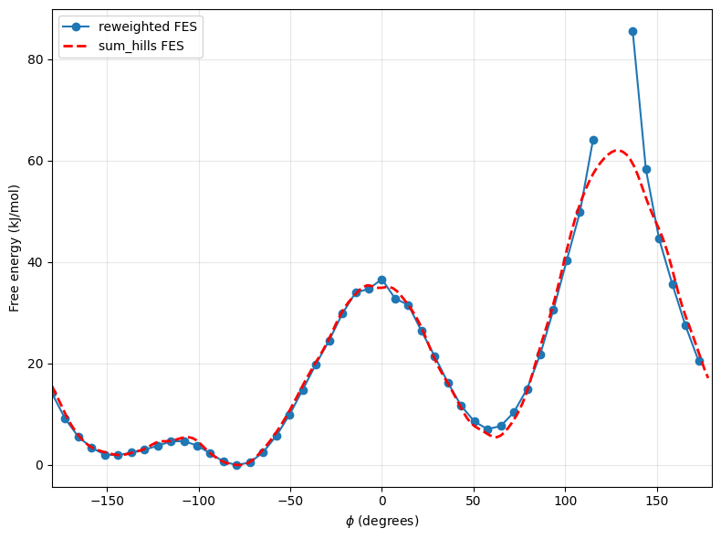

Notice in that the reweighted free energy (in blue) is in overall good agreement with the `sum_hills` (negative sum of all the accumulated Gaussian hills). In genral, the reweighted free energy is a more rigorous free energy estimate since the `sum_hills` result assumes you have reached the long-time limit:

$$F(s) = -\left(\frac{\gamma}{\gamma-1}\right)V(s)$$

whereas, the reweighting uses a [time-dependent estimate](https://pubs.acs.org/doi/10.1021/jp504920s) that is valid at shorter times. 

Notice that the agreement between the reweighted free energy (blue) and Gaussian sum hills (red) is better in the low free-energy basins and not as good near transition state regions (high free-energy regions). This reflects the sampling from the MD simulation. We sample much fewer configurations in the transition state region, so the free energy estimate will have larger error bars near the peaks. You will learn how to compute error bars for a reweighted free energy in a later tutorial. In fact, we don't sample many values of $$\phi$$ in the vicinity of $$\phi=140^{\circ}$$, so the reweighted free energy cannot give an estimate of the largest barrier height. The C7eq to C7ax transition occurs near $$\phi=0^{\circ}$$ with a barrier of about $$\Delta G^{\dagger}=36$$ kJ/mol. 

The shape of the free energy surface will depend on the order parameter (or variable) we are plotting. Mathematically, the probability distribution is a **histogram** of any observable $$s$$: 

$$ P(s) = \left< \delta[s - s(\textbf{R})]\right> $$ 

where the brackets $$\langle ...\rangle$$ represent the equilibrium average (Boltzmann distribution) and the delta function $$\delta[s - s(\textbf{R})]$$ picks out and counts atomic configurations $$\textbf{R}=\{R_1,R_2,...,R_N\}$$ that map to a specfic value of $$s$$. The free energy surface (FES) is defined as the logarithm of this probability distribution up to an additive constant:

$$ F(s) = -RT \ln P(s) $$ 

or rearranging, the histogram that we calculate from MD simulation, given sufficient sampling of the configuration space, is related to the free energy $$F(s)$$ as the Boltzmann factor:

$$ P(s) \propto e^{-F(s)/RT}$$. 

As a second example, we can also plot the free energy along the $$\psi$$ axis: 

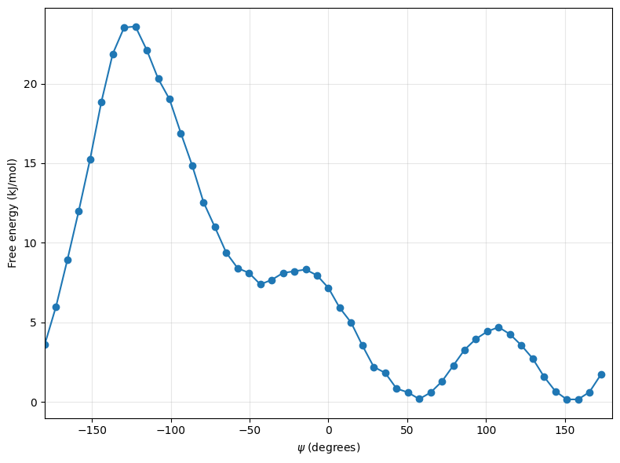

A good takeaway here is that the conformational landscape of this molecule depends on both $$\phi$$ and $$\psi$$ values. When we plot the free energy along a single axis, we are projecting a two-dimensional free energy surface along a single coordinate. This one-dimensional projection along a single coordinate can be useful for identifying metastable states and barriers but does capture the coupling between the two backbone dihedral angles.  

Congratulations, you have now completed the metadynamics tutorial. If you are interested in learning about more advanced collective variables that can be used to drive reactions or complex conformational transitions, you can move on to the [Path CVs Tutorial](../path-cvs/path_cvs_tutorial.md). If you are interested in learning about calculating error bars on histograms and reweighted free energy surfaces, you can skip to [Error Analysis and Quantifying Uncertainty from MD simulations](../error_analysis/error_analysis_plumed.md)

[Return to Day 2 homepage](../../day2.md)
