# Path CVs

This tutorial will introduce you to the concept of a path collective variable (CV). Biasing a path CV, you can enhance the sampling along a chosen path along the free energy surface. This is a powerfull approach for simulating complex reaction processes or structural transitions between two states where the endpoints are known.   

Once this tutorial is completed students will be able to:

- Generate a putative reaction path using `pathtools`.
- Prepare a PLUMED input file implementing a path collective variable (Path CV). 
- Perform a metadynamics simulation biasing the progress along the path and assess the sampling efficiency.
- Improve the sampling by performing two-dimensional metadynamics biasing both the progress along the path and the distance from the path.

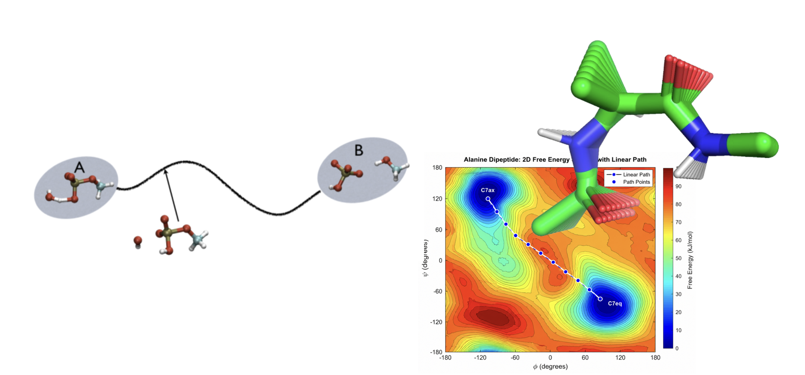

## Background 

In the previous [metadynamics tutorial](../metadynamics/metadynamics.md), we described the conformation of alanine dipeptide using the two backbone dihedral angles ($$\phi$$) and ($$\psi$$). Although these two variables provide a useful description of the conformational free-energy landscape for this simple molecule, many molecular transitions involve coordinated changes in a much larger number of atomic coordinates. When you deal with a complex conformational transition that you want to analyze (or bias), very often you cannot just describe it with a single order parameter (or collective variable).

As an example, consider a large conformational transition like the activatation of a kinase via an open-close transition of the activation loop. In the sticks representation, you see the part of the molecule involved in the large conformational change, whereas the structure of the rest of molecule (shown only in backbone cartoon) remains mostly unchanged between the X-ray structures (PDB: 2C5X and 2C5Y). This is a complex transition and it is hard to tell which is the collective variable (or order parameter) that best describes the transition.

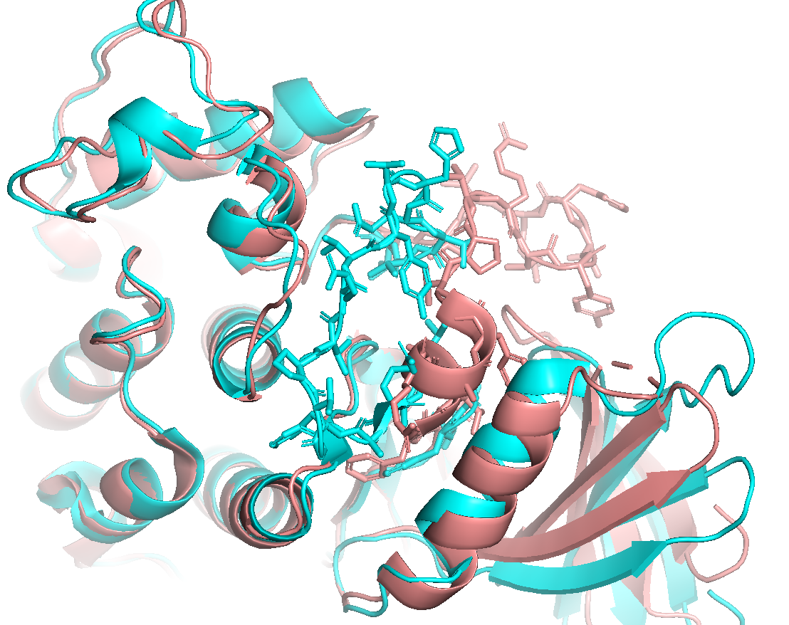

We would like to completely divide these two configurations with a colletive variable that discriminates between what intuitively one would think as the open and closed conformation. We would also like to capture the progress from open to closed state through a hypothetical transition state to see certain crucial interactions forming/breaking so to better explain what is really happening during this process.  

A **path collective variable** provides a convenient way to describe such a transition. Rather than selecting one or two individual structural variables, we define a series of reference configurations that connect an initial state to a final state. Any instantaneous molecular configuration can then be described by two quantities: its progress along the reference path and its distance away from that path.

In a nutshell, your reaction might be very complex and involving many simultaneous degree of freedom, but intuitively can be tracked along a "reaction coordinate" along which the reaction proceeds. So what we need is a coordinate that, given a conformation, just tells which point along the "reaction coordinate" is closest.

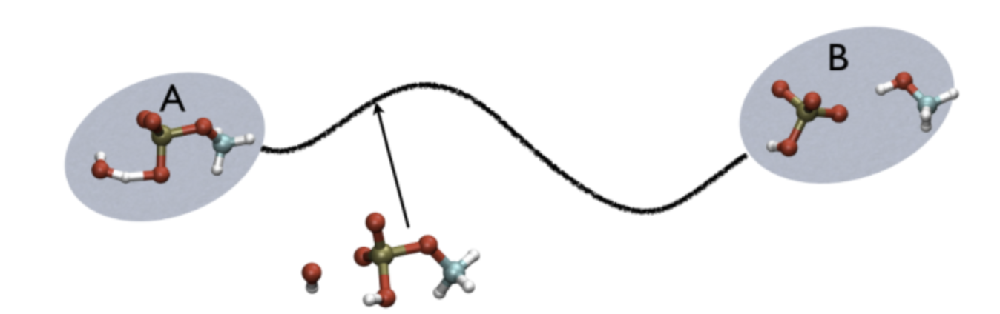

For example, in the above figure, you see a typical chemical reaction (hydrolysis of methyl phosphate) with the two end-points denoted by A and B. If you are given a third point, just by looking at it, you might find that this resembles the reactant more than the product. Hypothetically, if we create a parameter that describes progress along the reaction coordinate, $$\xi$$, and set $$\xi=1$$ for a configuration in the A state and $$\xi=2$$ for a configuration in the B state, then the third point along the path, $$\xi$$, would probably be something like $$\xi=1.3$$.

Path collective variables are the extension of this concept to the case where you have multiple conformations that describe a path, starting from the reactant state A and moving to the product state B. Therefore, instead of an index that goes from 1 to 2 you have an index that goes from 1 to N , where N is the number of conformations that you use to describe your path.

Mathematically, the progress along the path is calculated with the following equation:

$$s = \frac{\sum_{i=1}^N i \exp \left(-\lambda \|X-X_i\| \right)}{\sum_{i=1}^N \exp \left(-\lambda \|X-X_i\| \right)}$$

where $$\|X−X_i\|$$ represents a distance between any instantaneous configuration $$X$$ tp be analyzed and another reference configuration $$X_i$$ from a set that compose the path made of $$N$$ configurations. The parameter $$\lambda$$ is a positive value that is tuned in a way explained later.

The negative exponential function is something that is 1 whenever the value of the exponent is zero, and gets progressively smaller when the value is larger than zero. (Trivially, the value of the exponential function can never be larger than 1 since lambda is a positive quantity and the distance $$\|X-X_i\|$$ is by definition positive). Whenever you sit exactly on a specific images $$X_j$$ then all the other terms in the sum disappear (if $$\lambda$$ is large enough) and only the value $$j$$ survives, returning exactly $$s=j$$. The index $j$ will have integer values from 1 to N where N is the number of configurations in your path. Therefore, the quantity $$s$$ will have values between 1 and N and descibes the progress along the path.

At this point, we should be more specific about what we mean by the "distance" between configurations, since a distance between two conformations can be calculated in several ways. In this tutorial, we will use the RMSD distance for a subset of atoms after optimal alignment. This means that at each step in which the analysis is performed, a number N of optimal alignments must be performed.

As described above, $$s$$ measures the progress along the path from state A to state B. Another useful variable is the distance away from the closest point along the path, which is denoted with the $$z$$. This is defined as 

$$z = -\frac{1}{\lambda} \ln \left[\sum_{i=1}^N \exp \left(-\lambda \|X-X_i\|\right) \right]$$

In the above equation, we see that in case of perfect match of $$X=X_i$$ this equation gives a value of $$z=0$$. The two variables $$s$$ and $$z$$, put together can be visualized as:

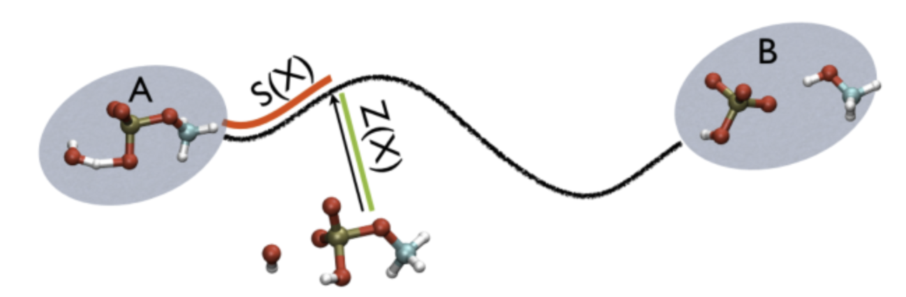 

In the above figure, the $$s$$ variable can be thought as the length of the red segment, while the $$z$$ variable is the length of the green segment. 

Monitoring the $$z$$ variable in addition to $$s$$ is important because whenever your simulation is running close to the path (low Z values), then you know that you are reproducing reliably the path you provided, but if by chance you find some other path that goes from $$s=1$$ to $$s=N$$ via large $$z$$ values, then it might well be that you have just discovered a good alternative pathway. 

## Getting started

In this tutorial you will again study the C7eq to C7ax transition of the so-called alanine dipeptide molecule (N-acetyl-L-alanine-N'-methylamide):

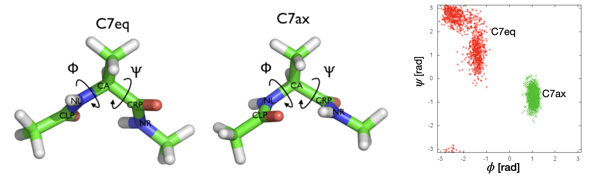

Unlike the previous metadynamics tutorial, here we will demonstrate the use of path CVs to accomplish this transition. The example is particularly useful because we know that the Ramachandran space defined by the $$\phi$$ and $$\psi$$ angles will be a good descriptor of the conformational landscape. Therefore, we can assess how well are path is able to go from state A to state B by monitoring the $$\phi$$ and $$\psi$$ angles even though we will not be directly biasing them. 

**Files**
Files to complete this tutorial can be accessed here:
[tutorial files](coming soon)

These files are already located on bigzam:
/opt/workshop/path-CVs/ 

Use PuTTY to connect to bigzam as you did in previous [tutorials](../../day1/lj_fluid/lj_fluid_tutorial.md). Open PuTTY from the Window Start menu and enter `bigzam.local` for the Host Name. Login using the terminal using your username and password.

**Important**: Once connected to the workshop computer, set your environment variables by typing:


source setup.sh


Copy the tutorial files by typing in the terminal:

In the terminal type:

cp -r /opt/workshop/path-CVs/ ~/


This will copy the necessary tutorial files to your home directory on bigzam.

**Tip**: You can press the Tab key to automatically complete file and directory names. This can save time and help avoid typing errors.

Move into the path-CVs directory:


cd ~/path-CVs


Within this directory you will find the following files:

- dialaA.pdb: A reference PDB structure file of the molecule
- alanine_dipeptide.gro: A GROMACS structure file (.gro)
- topol.top: A GROMACS topology file (.top)
- vacuum.mdp: A GROMACS parameter file (.mdp)

## Generating a path collective variable

Suppose we have limited information about the transition state or reaction path, but we know the starting and ending configuration. In our example molecule, this corresponds to the C7eq state and the C7ax state that we can visualize on a 2D Ramachandran plot:

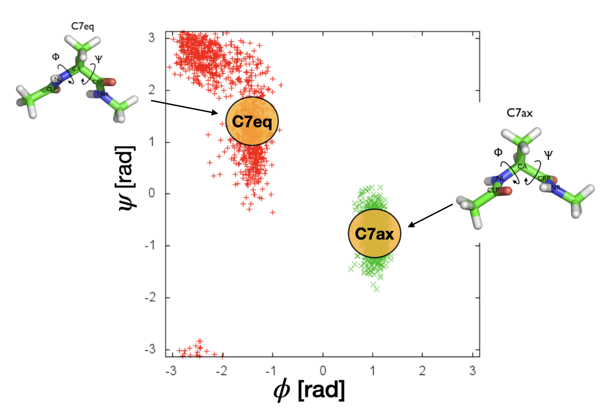

In this case we might consider creating a path that starts at one basin and goes to the other along a straight line. To do this we need to generate equally spaced configurations that extrapolate between the two basins. A reasonable question to ask is how many frames do we need? The answer depends on the limiting scale in your reaction. For example, if in your process you have a torsion rotation as the smallest event that you want to capture with a path collective variable, then it is important that you mimic that torsion in the path and that this does not contain simply the initial and final point but also some intermediate. Similarly, if you have a concerted bond breaking, it might be that this takes place in the range of an Angstrom or so. In this case you should have intermediate frames that cover the sub-Angstrom scale. If you have both in the same path, then the smallest scale motion dominates.

In this example, you will use the `pathtools` feature in PLUMED to generate an initial linear path connecting two structure (pdb) frames representing the initial reactant and final product states. The path itself is an ordered set of equally-spaced, frames that interpolate between the reactant and product states.

In this case, I have provided a reference structure (pdb) file for the reactant state, `c7eq.pdb`, and product state `c7ax.pdb`. Pay careful attention to the format of these pdb files:


ATOM      2  CH3 ACE     1      -3.220   0.160   1.920  1.00  1.00
ATOM      5  C   ACE     1      -1.800  -0.210   1.630  1.00  1.00
ATOM      6  O   ACE     1      -1.100  -0.890   2.410  1.00  1.00
ATOM      7  N   ALA     2      -1.400   0.350   0.520  1.00  1.00
ATOM      8  H   ALA     2      -1.940   0.980  -0.030  1.00  1.00
ATOM      9  CA  ALA     2      -0.060   0.000   0.060  1.00  1.00
ATOM     10  HA  ALA     2       0.060  -1.060   0.230  1.00  1.00
ATOM     11  CB  ALA     2      -0.020   0.050  -1.500  1.00  1.00
ATOM     15  C   ALA     2       1.160   0.770   0.730  1.00  1.00
ATOM     16  O   ALA     2       1.790   1.670   0.150  1.00  1.00
ATOM     17  N   NME     3       1.470   0.480   1.990  1.00  1.00
ATOM     18  H   NME     3       0.910  -0.190   2.480  1.00  1.00
ATOM     19  CH3 NME     3       2.650   1.120   2.570  1.00  1.00
END


You do not need to include every atom in the pdb file to define the path, but the atom number *must match the full structure** for your simulation. Notice here I am not including hydrogen atoms on the ACE group or NME group, so the atom numbers run from 2,5,6,7,8,9,10,11,15,16,17,18,19. Confirm that these match the atom numbers for the whole molecule we will use from the simulation:


cat alanine_dipeptide.gro 


The atom numbers in the third column of the `alanine_dipeptide.gro` file.

**Important**: In your reference structure (pdb) file the last column is the occupancy number and this must be all 1.00 to be included in the optimal alignment. If these occupancy numbers are zero, then PLUMED cannot do the alignment. Therefore, always check to make sure the last column is all 1.00's. 
  
In the following example, we will generate a linear path by typing in the terminal:


plumed pathtools --start c7eq.pdb --end c7ax.pdb --nframes 10 --metric OPTIMAL --out linear_path.pdb
 

Here we are telling PLUMED to extrapolate a path of 10 equally-spaced frames between the c7eq.pdb structure and c7ax.pdb structure. The output file, `linear_path.pdb`, will be a pdb file with 12 total frames (one for each the start and the end state and 10 frames in between). 

If you want to visualize the path, I have included a python code, `convert_path2_pymol.py` that will write the path frames to a format that can be read by PyMOL. In the terminal type:


python convert_path2_pymol.py linear_path.pdb c7ax.pdb linear_path_4pymol.pdb
   

Then transfer the output `linear_path_4pymol.pdb` to your local Windows machine using the WinSCP app and load your structure in PyMOL.

After loading the `linear_path_4pymol.pdb` file into PyMOL, type the following into the consol to align the frames:


intra_fit linear_path_4pymol, 1
  

You can then play through the frames by clicking on the play button on the bottom right. To see the movie slower you can set in the PyMOL toolbar: Movie –> Frame Rate –> 5 FPS.

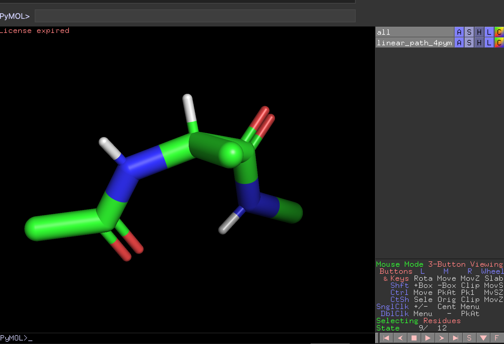

You should observe that our path smoothly rotates about the dihedral angles. 

In the path CV formula, the smooting parameter $$\lambda$$ controls how strongly the path CV is localized around the nearest reference structure. A general rule of thumb is to use the following formula:

$$\lambda = \frac{2.3 N}{\sum_{i=1}^N \| X_i - X_{i+1}\|}$$ 

which implies that one should calculate the average distance between consecutive frames composing the path. This heuristic is just a starting guess, and practically, $$\lambda$$ can be tuned so that the path equation gives a smooth and continuous function. 

In PLUMED it is straightforward to implement a path CV with the following line:


path: PATH REFERENCE=linear_path.pdb TYPE=OPTIMAL LAMBDA=1200
    

This defines a variable called `path` that takes as input a reference PDB file that containts the path frames. The path variable will have two components: `path.spath` - the distance along the path and `path.zpath` - the distance from the path.

## Metadynamics using a path CV 

I have provided a template PLUMED input file called `plumed-linear-path.dat` that will perform metadynamics on the $$s$$ path variable. Have a look at this file by typing:


cat plumed-linear-path.dat
  


# set up two variables for Phi and Psi dihedral angles 
phi: TORSION ATOMS=5,7,9,15
psi: TORSION ATOMS=7,9,15,17

path: PATH REFERENCE=linear_path.pdb TYPE=OPTIMAL LAMBDA=1200

metad: METAD ...
  ARG=path.spath
  SIGMA=0.05 
  HEIGHT=1.5 
  TEMP=300 
  BIASFACTOR=12 
  PACE=500
  FILE=HILLS GRID_MIN=0 GRID_MAX=12.5
...

PRINT ARG=phi,psi,path.spath,path.zpath,metad.bias STRIDE=100 FILE=COLVAR_linear_path.dat
  

The first lines define the usual $$\phi$$ and $$\psi$$ dihedral angles that we can use to assess the transition from reactant to product state. 

The next line defines the path CV with the variable name `path`. We then setup a metadynamics bias similar to the previous [metadynamics tutorial](../metadynamics/metadynamics.md). Here, the `ARG=path.spath` specifies that we will perform metadynamics on the $$s$$ component of the path (distance along the path). Finally, we print the output to a file called `COLVAR_linear_path.dat`. 

To run this metadynamics simulation type:


gmx grompp -f vacuum.mdp -c alanine_dipeptide.gro -p topol.top -o path-mdrun1.tpr

gmx mdrun -v -deffnm path-mdrun1 -plumed plumed-linear-path.dat


When this job finishes, the output file will be `COLVAR_linear_path.dat`. Transfer this file from bigzam to your local Windows machine using WinSCP. The columns of this file are specified by the `#! FIELDS` line:


#! FIELDS time phi psi path.spath path.zpath metad.bias
 

The first column is the simulation time (ps), the second and third column are the $$\phi$$ and $$\psi$$ angles (used for monitoring the progress of the reaction, but not directly biased), and the fourth and fifth column are the $$s$$ and $$z$$ path variables. Finally, the sixth column is the metadynamics bias. Upload your `COLVAR_linear_path.dat` file to the following [Google Colab link](https://colab.research.google.com/drive/1N4rXPjY5-O4Hhe7dbcL2sH7SRZbHU7eq?usp=sharing).

First we plot the progress along the path variable $$s$$ as a function of time to examine how the system moves along the chosen reaction path.

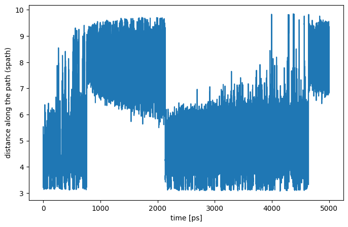

The trajectory clearly transitions between low and high values of $$s$$ demonstrating that metadynamics successfully drives the system between the two endpoint states. Long periods where $$s$$ fluctuates within a narrow range correspond to the system residing in one metastable basin, while the sharp transitions indicate barrier crossings promoted by the increasing metadynamics bias.

Next, we can compare this with the time evolution of the $$\phi$$ angle:

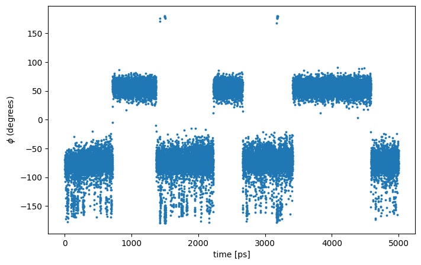

Notice that transitions in the path progress variable $$s$$ occur at the same time as jumps in the $$\phi$$ angle, indicating that the system is moving between the C7eq and C7ax conformational states. This is confirmed by plotting the two-dimensional Ramachandran plot, which clearly shows that the simulation samples two regions corresponding to the two metastable states. 

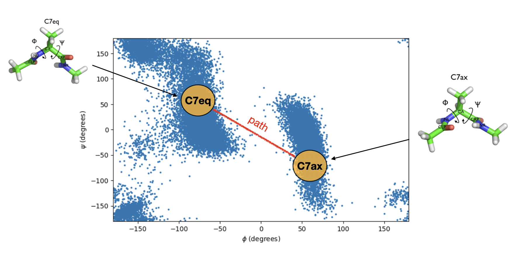

Although the metadynamics bias is applied along a linear path connecting the C7eq state to the C7ax state, the actual sampled transition does not appear to follow a straight line in $$\phi$$-$$\psi$$ space. Our linearly extrapolated path captures the overall transition but is only an approximation to the underlying transition path. 

Finally, it is instructive to examine the two-dimensional plot of the distance from the path $$z$$ and the progress along the path $$s$$. 

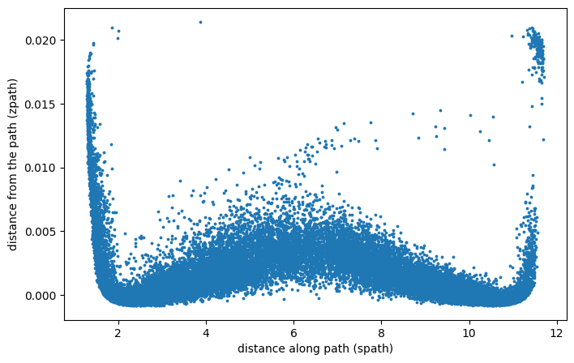

If the path CV were an ideal description of the transitin path, the sampled configurations between the end points would remain tightly clustered near small values of $$z$$. Instead, we see an arch-shaped distribution in the $$z$$ coordinate near the middle of the $$s$$ path progress. This indicates that the system is going through pathways connecting the reactant state A and product state B that are different from our putative path. In other words, the system explores multiple transition routes that are not well described by the linear interpolation between the endpoint structures.

This is an important point: although metadynamics successfully drives transitions between the two metastable states, the system naturally explores configurations away from the chosen path. This suggests two possible improvements. First, the reference path can be refined by constructing a nonlinear path from representative structures sampled along an actual transition. Second, the sampling can be further enhanced by biasing both the progress along the path $$s$$ **and** the distance from the path $$z$$, allowing the simulation to explore alternative transition pathways more efficiently. We will explore each of these improvements below.

## Constructing a better path: Nonlinear path

A better path can be constructed by selecting representative structures from a MD simulation that has already sampled the transition. Here, I have chosen representative frames from our previous metadynamics simulation where we biased both the $$\phi$$ and $$\psi$$ dihedral angles. These frames were selected according to their $$\phi$$ and $$\psi$$ values along the approximate minimum free energy pathway connecting the C7eq and C7ax states. These series of frames are combined to make a path called `path_raw.pdb` provided with the workshop files. 

Because the structures used to construct the `path_raw.pdb`  were selected based on their $$\phi$$, $$\psi$$ values alone, consecutive frames in this path are not equally spaced. Therefore, the file `path_raw.pdb` cannot be used directly in its current form as a path CV for metadyanmics. Fortunately, the `pathtools` utility in PLUMED is able to take an input trajectory of unequally spaced frames and output a path of evenly spaced frames. To do this, type the following in the terminal:


plumed pathtools --path path_raw.pdb --metric OPTIMAL --out right_path.pdb
  

This will generate a new path file called `right_path.pdb` containting approximately equally spaced reference structures. 

In the figure below, I have plotted our optimized path in $$\phi$$-$$\psi$$ space (yellow squares) in comparison with our original linear path from above (white circles), overlaid on the two-dimensional free energy surface obtained from the previous metadynamics simulation. 

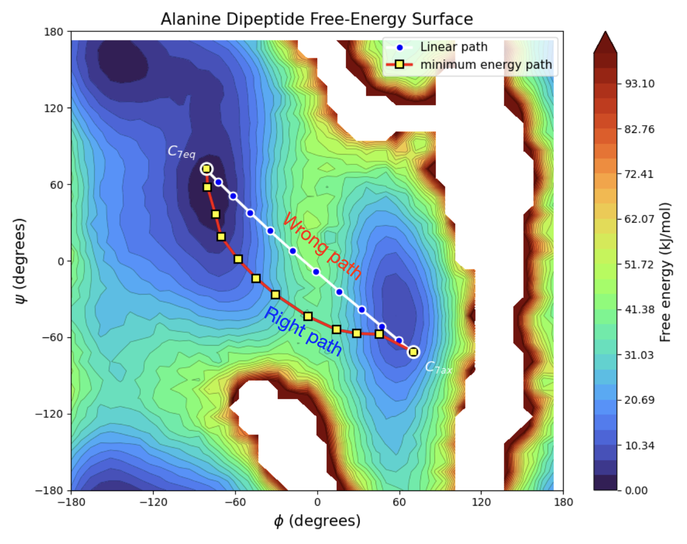

As you can see, the new optimal path is non-linear in the $$\phi$$-$$\psi$$ space, but closely follows the pathway of lowest free energy connecting the C7eq and C7ax states, whereas the linear path cuts directly across regions of higher free energy. This path provides a better desription of the transition and should serve as a more effective collective variable for metadynamics simulations.

The template PLUMED input file `plumed-right-path.dat` is provided with the tutorial files. Edit the `plumed-right-path.dat` by typing: 


nano plumed-right-path.dat


And replace the `__FILL__` with the correct input text. Then save by typing `Ctrl+O` followed by the `Enter` key. Then `Ctrl+X` to exit the text editor.

Run metadynamics on the more optimal path CV by typing:


gmx grompp -f vacuum.mdp -c alanine_dipeptide.gro -p topol.top -o path-mdrun2.tpr

gmx mdrun -v -deffnm path-mdrun2 -plumed plumed-right-path.dat


When this job finishes, transfer the output file `` to your local Windows machine and view with the same [Colab as before](https://colab.research.google.com/drive/1N4rXPjY5-O4Hhe7dbcL2sH7SRZbHU7eq?usp=sharing). 

## Two-dimensional metadynamics in path CV space

Run 2D metad on spath and zpath

Show Ramachandran plot

Show 2D s vs. z plot

Reweight FES along phi. 
