# Using Restraints

In this tutorial you will learn how to implement a restraint using PLUMED. By applying restraints on one or more collective variables, you can restrict the sampling to a desired region. This will introduce you to the idea of using a bias to manipulate a simulation on-the-fly. 

Once this tutorial is completed students will be able to:

- Apply a restraint on a simulations over one or more collective variables
- Understand the effect of a restraint on the acquired statistics
- Perform an out-of-equilibrium simulation with a moving restraint

 
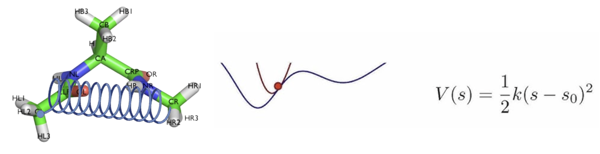

In the [previous introduction to PLUMED syntax tutorial](../../day1/intro_plumed_syntax/analysis.md), you used PLUMED as a post-processing tool to  calculate properties of the system on a previously generated MD simulation trajectory. In addition to being a post-processing tool, PLUMED can also interface with the MD code "on-the-fly" during a MD simulation. The atomic coordinates and atoms at a given instant can be passed to the PLUMED code to manipulate a simulation on-the-fly. This allows one to bias the simulation by adding extra constraints in addition to the standard force field terms. The additional energy terms are usually referred as **Bias**. 

## The molecule of the day

Throughout today's tutorial you will play with the terminally capped alanine molecule (specifically, N-acetyl-L-alanine-N'-methylamide). The molecule has the total chemical formula C6H12N2O2 and consists of a central alanine amino group, with flanking acetyl and methylamide groups to have neural (uncharged) end-groups. In the computational literature this molecule is frequently abbreviated as Ace-Ala-NMe. 

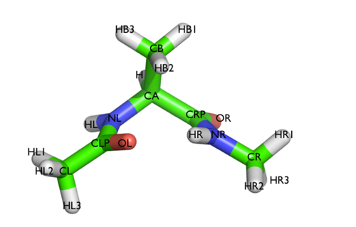

While simple, this system is a nice example because it presents two metastable states separated by a high free-energy barrier. It is conventional to characterize the two states in terms of Ramachandran dihedral angles, which are denoted with $$\phi$$ and $$\psi$$. As you can see the $$\phi$$ and $$\psi$$ angles distinguish between the C7eq and C7ax state shown in red and green in the Ramachandran plot. 

**Files**
Files to complete this tutorial can be accessed here:
[tutorial files](coming soon)

These files are already located on bigzam:
/opt/workshop/using_restraints/

## Getting Started 

Use PuTTY to connect to bigzam as you did in previous [tutorials](../../day1/lj_fluid/lj_fluid_tutorial.md). Open PuTTY from the Window Start menu and enter `bigzam.local` for the Host Name. Login using the terminal using your username and password.

**Important**: Once connected to the workshop computer, set your environment variables by typing:


source setup.sh


Copy the tutorial files by typing in the terminal:

In the terminal type:

cp -r /opt/workshop/using_restraints/ ~/


This will copy the necessary tutorial files to your home directory on bigzam.

**Tip**: You can press the Tab key to automatically complete file and directory names. This can save time and help avoid typing errors.

Move into the using_restraints directory:


cd ~/using_restraints


Within this directory you will find the following files:

- dialaA.pdb: A reference PDB structure file of the molecule
- alanine_dipeptide.gro: A GROMACS structure file (.gro)
- topol.top: A GROMACS topology file (.top)
- vacuum.mdp: A GROMACS parameter file (.mdp) 

## Adding a constant bias potential 
In the following we will see how to apply a constant bias potential. We can add a harmonic restraint on any variable according to the formula:

$$V_{bias}(x)=\frac{1}{2}\kappa (x-x_0)^2 $$

where $$x_0$$ is the value around which we want to put a restraint and $$\kappa$$ determines the strength (spring constant) of the restraint. Notice that if we implement this restraint, there will be a linear restoring force proportional to $$\kappa$$ to keep $$x$$ near the value of $$x_0$$. 

An example PLUMED input file called plumed_example1.dat is provided with the workshop materials. Have a loot at this file with:


cat plumed_example1.dat 
  

Here we see the plumed_example1.dat file contents:

<strong>Contents of <code>plumed_example1.dat</code></strong>

<pre style="background-color:transparent; border:none; margin-bottom:0;"><code>MOLINFO STRUCTURE=dialaA.pdb

# set up two variables for Phi and Psi dihedral angles 
phi: TORSION ATOMS=5,7,9,15
psi: TORSION ATOMS=7,9,15,17

# Set up harmonic restraint 
restraint: RESTRAINT ARG=phi KAPPA=10 AT=-1.5

# Print output
PRINT FILE=dihedrals_weak_restraint.dat ARG=phi,psi,restraint.bias STRIDE=100 </code></pre>

The first two lines tell PLUMED to compute the $\phi$ and $\psi$ angles and store these values as variables `phi` and `psi`. The next line specifies that we are putting a restraint on the `phi` variable centered around a values of -1.5 radians with a harmonic spring constant of $$\kappa=10$$ kJ/mol specified by the `KAPPA` keyword. Finally, we are printing both the dihedral angles and the value of the bias potential to the file called `dihedrals_weak_restraint.dat`. The frequency of writing to the output file is specified by the STRIDE keyword. Here we are printing every 100 steps (0.2 ps). After looking at this file, you can set up a **biased** simulation in GROMACS by typing:


gmx grompp -f vacuum.mdp -c alanine_dipeptide.gro -p topol.top -o run1.tpr
  

and run the simulation by typing:


gmx mdrun -v -deffnm run1 -plumed plumed_example1.dat -nt 1


Notice here the command for running the biased simulation is identical to running an unbiased simulation using GROMACS `mdrun` except that we must specify a plumed input file with the `-plumed` flag in the `mdrun` command. This tells GROMACS to run with PLUMED compiled on-the-fly. 

Note: If you run the simulation more than once, PLUMED will overwrite the previous output file and create a new `dihedrals_weak_restraint.dat`, but store the previous file as `bck.0.dihedrals_weak_restraint.dat`.

Looking at the output file by typing:


head dihedrals_weak_restraint.dat


we see that we have written to the file the time (in ps), the $\phi$ and $\psi$ angles (in radians) and the value of the bias potential (in kJ/mol). 


#! FIELDS time phi psi restraint.bias
#! SET min_phi -pi
#! SET max_phi pi
#! SET min_psi -pi
#! SET max_psi pi
 0.000000 -1.498385 0.273949 0.000013
 0.200000 -1.201216 0.855335 0.446359
 0.400000 -1.381729 1.547420 0.069940
 0.600000 -1.224698 1.245825 0.378956
 0.800000 -1.523365 0.695065 0.002730


The restraint is only one contribution to the potential energy. The molecule also experiences its own torsional potential, and the observed $$\phi$$ distribution  will reflect both the effect of the bias and the underlying free energy landscape of the molecule. Here the bias we are adding is fairly weak (10 kJ/mol). 

Investigate what happens when you increase the force constant (KAPPA) in the harmonic restraint. Here, you are effectively making the restoring spring stiffer. In the plumed template provided `plumed_example2.dat` edit the file by typing 


nano plumed_example2.dat



# set up two variables for Phi and Psi dihedral angles 
phi: TORSION ATOMS=5,7,9,15
psi: TORSION ATOMS=7,9,15,17

# Set up harmonic restraint 
restraint: RESTRAINT ARG=phi KAPPA=__FILL__ AT=-1.5

# Print output
PRINT FILE=dihedrals_strong_restraint.dat ARG=phi,psi,restraint.bias STRIDE=100


Replace where it says `__FILL__` with a KAPPA values of 250 kJ/mol. Then save by typing `Ctrl+O` followed by the `Enter` key. Then `Ctrl+X` to exit the text editor. 

After you have saved changes to the `plumed_example2.dat` file, rerun the biased simulation using the new restraint by typing:


gmx grompp -f vacuum.mdp -c alanine_dipeptide.gro -p topol.top -o run2.tpr

gmx mdrun -v -deffnm run2 -plumed plumed_example2.dat -nt 1


The resulting output file will be called `dihedrals_strong_restraint.dat`. 

Transfer both the outputs, `dihedrals_weak_restraint.dat` and `dihedrals_strong_restraint.dat`, from your biased simulation to your local Windows machine using the WinSCP app. Then you can use the following Google Colab link for plotting the histogram of the $$\phi$$ angle. 

[plotting fixed bias restraint](https://colab.research.google.com/drive/16zAuRBcJ5jKBzlM-j3aC3Adl6bdNG52_?usp=sharing)

First upload both files to the Google Colab:

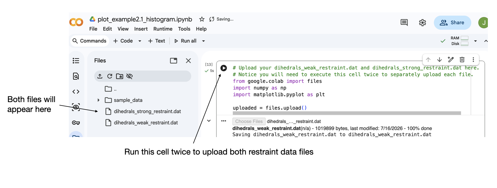 

Here we see that the biased simulation with the weak harmonic restraint ($$\kappa=10$$) samples a larger range of $$\phi$$ values and the parabolla corresponding to the harmonic bias potential is shallower. The biased simulation with the strong harmonic restraint ($$\kappa=250$$) is centered more sharply around $$\phi_0$$ and has a steeper parabolla. 

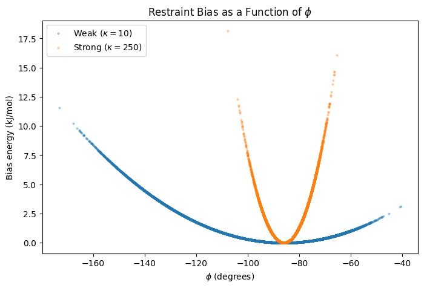

Next, look at the distribution of sampled $$\phi$$ values from the histogram. 

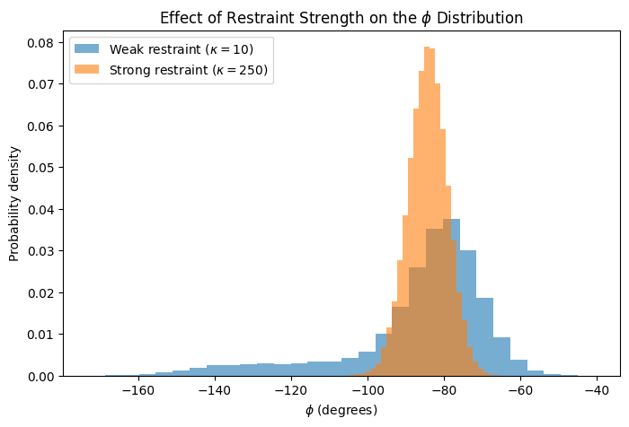

Here we see that the weaker biased simulation is not Gaussian distributed about the mean but has a pronounced tail toward more negative $$\phi$$ value. On the other hand, the strongly biased simulation shows a Gaussian distributed value of $$\phi$$ about the mean due to the strong harmonic restraint placed at this value. 

## Moving Restraint 

In PLUMED you can bring a system into a specific state using the collective variable by means of a `MOVINGRESTRAINT` directive. This directive is very flexible and allows for a programmed series of moving restraints. When you use a restraint to drag the system from an initial configuration to a final one by pulling one or more CVs, this is called **Steered MD (SMD)**. Moving restraints can be used to prepare the system in a particular state or produce nice snapshots for a cool movie. Keep in mind that the MD trajectory produced by a moving restraint will be out of equilibrium because of the irreversible driving force from the restraint.

Suppose that you want to steer the Ace-Ala-Nme molecule from the C7eq conformational state to the C7ax state. We could accomplish this just by dragging along the $$\phi$$ dihedral angle from a value of -1.5 rad to a value 1.0 rad.  Additionally, it might be important not to stress the system too much, so we will first increase the $$\kappa$$ value to lock the system in at $$\phi=−1.5$$ radians, then gradually  move it gently to $$\phi=1.0$$ radians, and then finally release the spring constant so that we end up with an equilibrated and unconstrained state in the C7ax state. 

The example PLUMED input file called `plumed_example3.dat` provided with the workshop materials will implement such a moving restraint. Look at the contents of this file with:


cat plumed_example3.dat
 


# set up two variables for Phi and Psi dihedral angles 
phi: TORSION ATOMS=5,7,9,15
psi: TORSION ATOMS=7,9,15,17

# Here we set up a moving restraint 
restraint: ...
        MOVINGRESTRAINT
        ARG=phi
        AT0=-1.5  STEP0=0      KAPPA0=0
        AT1=-1.5  STEP1=2000   KAPPA1=1000
        AT2=1.0   STEP2=20000  KAPPA2=1000
        AT3=1.0   STEP3=22000  KAPPA3=0
...

# Print output
PRINT FILE=dihedrals_moving_restraint.dat ARG=phi,psi,restraint.bias STRIDE=100
 

Notice in the above we define a MOVINGRESTRAINT on the `ARG=phi` variable starting at $$\phi=-1.5$$ radians at 0 ps and an initial $$\kappa=0$$  specified with `KAPPA0=0`. We then slowing increase $$\kappa$$ from 0 to 1000 kJ/mol over the first 2000 steps (4 ps). We then move the center of the harmonic restraint from $$\phi=-1.5$$ rad to $$\phi=1.0$$ rad between step 2000 and 20000 (40 ps). Finally we decress $$\kappa$$ from 1000 kJ/mol to 0 for 1000 steps (4 ps). After this the simulation will continue without any additional bias. 

Once you have read and understand this PLUMED input file, run the biased simulation (Steered MD) as follows:


gmx grompp -f vacuum.mdp -c alanine_dipeptide.gro -p topol.top -o run3.tpr

gmx mdrun -v -deffnm run3 -plumed plumed_example3.dat -nt 1


The resulting output file will be called `dihedrals_moving_restraint.dat`. Copy this file to your Windows machine using WinSCP and plot the results using the following Colab link:

[plot moving restraint](https://colab.research.google.com/drive/1BmO4rDPViurIlLt3GC0WC7n2IgjDoA98?usp=sharing)

The plot of the $$\phi$$ value over the first 200 ps shows the result of our out-of-equilibrium simulation. The region where $$\phi$$ is increasing linearly corresponds to the pulling along the $$\phi$$ coordinate from -1.5 radians to 1.0 radians over the course of about 40 ps. 

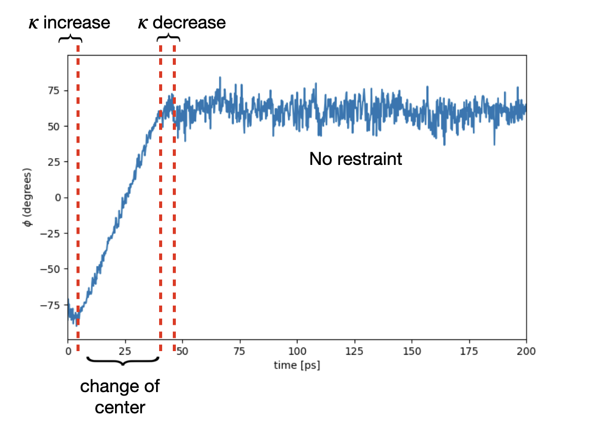

We visualize this on a 2-D Ramachandran plot where each point is a frame from the simulation plotting the $$\phi$$ vs. $$\psi$$ value. Notice that by pulling along the $$\phi$$ coordinate, we were able to force the transition from the C7eq to the C7ax state. 

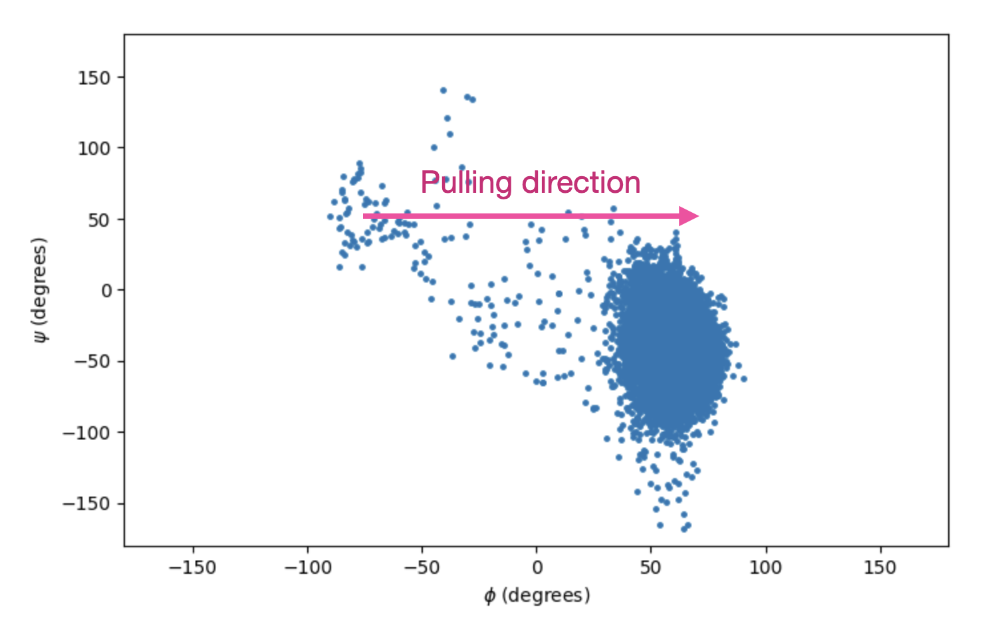

### Pulling along a more complex path

Sometimes it is useful to use a moving restraint to schedule a sequence of events. For example, you can use a MOVINGRESTAINT to drive multiple collective variables at the same time in specific points and also to stop for a while in specificregions using a fixed harmonic potential. 

In `plumed_example4.dat` we set up a MOVINGRESTRAINT to go from the C7eq state vertically toward $$\phi=−1.5$$ rad;$$\psi=−1.3$$ rad. We then stop at this intermediate state for a while, then move toward $$\phi=1.3$$;$$\psi=−1.3$$ rad which corresponds to C7ax.


# set up two variables for Phi and Psi dihedral angles 
phi: TORSION ATOMS=5,7,9,15
psi: TORSION ATOMS=7,9,15,17

# Here we set up a moving restraint 
restraint: ...
        MOVINGRESTRAINT
        ARG=phi,psi
        AT0=-1.5,1.3  STEP0=0      KAPPA0=0,0
        AT1=-1.5,1.3  STEP1=2000   KAPPA1=1000,1000
        AT2=-1.5,-1.3 STEP2=10000   KAPPA2=1000,1000
        AT3=-1.5,-1.3 STEP3=12000   KAPPA3=1000,1000
        AT4=1.3,-1.3  STEP4=20000   KAPPA4=1000,1000
        AT5=1.3,-1.3  STEP5=24000   KAPPA5=0,0
...

# Print output
PRINT FILE=dihedrals_moving_restraint_v2.dat ARG=phi,psi,restraint.bias STRIDE=100


Notice in the input for this example, we have two arguments for the moving restraint (separated by comma, no spaces between arguments!) and correspondingly two KAPPA values - one for each variable.

Run this example using:


gmx grompp -f vacuum.mdp -c alanine_dipeptide.gro -p topol.top -o run4.tpr

gmx mdrun -v -deffnm run4 -plumed plumed_example4.dat -nt 1


The output file here will be called `dihedrals_moving_restraint_v2.dat`. See if you can use the same plotting script to generate the 2-D Ramachandran plot:

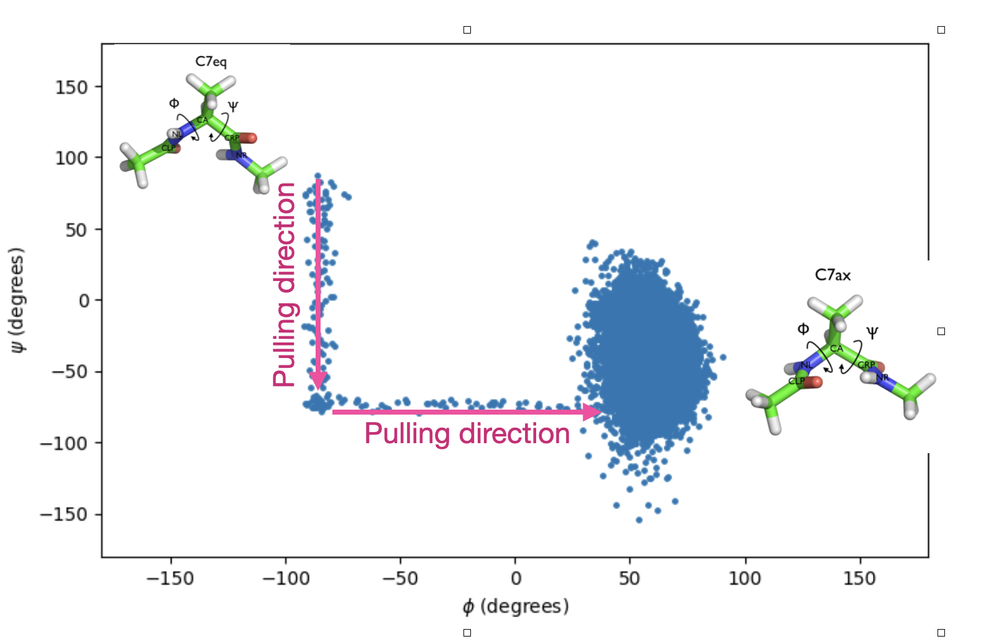

Congratulations, you have now learned how to perform Steered MD using a moving restraint. At this point you can move onto the [Biasing with Metadynamcics Tutorial](../../day2/metadynamics/metadynamics.md), or feel free to check out the optional extensions below.

## (Optional extension) Targeted MD

Targeted MD can be seen as a special case of steered MD where the RMSD from a reference structure is used as a collective variable. In this case, we use PLUMED to create a MOVINGRESTRAINT on the RMSD value to push the simulation to a target reference structure. It can be used for example if one wants to prepare the system so that the coordinates of selected atoms are as close as possible to a target pdb structure taken from an experimental structure.

An example input is provided called `plumed_targetedMD.dat`: 


# set up two variables for Phi and Psi dihedral angles
# these variables will be just monitored to see what happens
phi: TORSION ATOMS=5,7,9,15
psi: TORSION ATOMS=7,9,15,17
# define a variable that measures the RMSD from a reference pdb structure
# the RMSD is measured after OPTIMAL alignment with the target structure
rmsd: RMSD REFERENCE=c7ax.pdb TYPE=OPTIMAL
# the movingrestraint
restraint: ...
        MOVINGRESTRAINT
        ARG=rmsd
        AT0=0.0 STEP0=0      KAPPA0=0
        AT1=0.0 STEP1=__FILL__   KAPPA1=__FILL__
...
# monitor the two variables and various restraint outputs
PRINT STRIDE=100 ARG=phi,psi,rmsd,restraint.bias FILE=targetedMD.dat


In this example, the RMSD is being calculated relative to a provided reference pdb file. Here, I have provided a pdb file called `c7ax.pdb` as a representative structure for the C7ax state. 

Note that RMSD should be provided a reference structure in pdb format and can contain part of the system **but the second column (the index) must reflect the atom numbering within the full system** so that PLUMED knows specifically which atom to drag where. In this case the pdb file `c7ax.pdb` contains only the non-hydrogen, heavy atoms:


ATOM      2  CH3 ACE     1      -3.200   1.510   1.150  1.00  1.00            
ATOM      5  C   ALA     1      -1.930   1.410   0.410  1.00  1.00            
ATOM      6  O   ALA     1      -1.530   2.340  -0.280  1.00  1.00            
ATOM      7  N   ALA     1      -1.250   0.260   0.560  1.00  1.00            
ATOM      9  CA  ALA     1       0.030  -0.060  -0.050  1.00  1.00            
ATOM     10  HA  ALA     1       0.230  -1.090   0.200  1.00  1.00            
ATOM     11  CB  ALA     1       0.000   0.010  -1.600  1.00  1.00            
ATOM     15  C   ALA     1       1.210   0.710   0.560  1.00  1.00            
ATOM     16  O   ALA     1       2.020   0.140   1.270  1.00  1.00            
ATOM     17  N   NME     1       1.310   2.020   0.270  1.00  1.00            
ATOM     19  CH3 NME     1       2.390   2.850   0.750  1.00  1.00            
END


**Important**: Atom numbers in column 2 of the reference pdb file must match the atom numbers in column 3 of the GROMACS .gro file (alanine_dipeptide.gro) 

The MOVINGRESTRAINT bias potential acts here on the rmsd, and the other two variables (phi and psi) are untouched. The RMSD action in PLUMED will perform an optimal alignment of the structure at each frame with reference structure when computing the RMSD value. 

To run this example, change where it says `__FILL__` by setting the final tep to be `STEP1=5000` and `KAPPA1=10000`. When you have made these changes, run the targeted MD using:


gmx grompp -f vacuum.mdp -c alanine_dipeptide.gro -p topol.top -o targeted_run.tpr

gmx mdrun -v -deffnm targeted_run -plumed plumed_targetedMD.dat -nt 1


The output file will be called `targetedMD.dat`. See if you can generate a 2-D Ramachandran plot such as the one shown here:

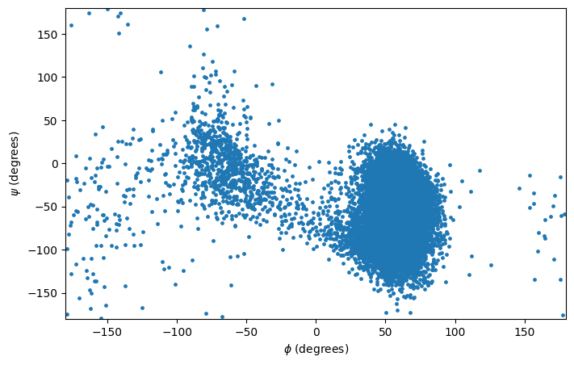

Notice the moving restraint on the RMSD drove the system from the C7eq to the C7ax state. 

## (Optional extension) Umbrella Sampling

We have seen above how to use PLUMED to create a harmonic restraining potential  about a specific value of $$\phi$$. We can use the restraint to force the system to sample higher energy states along a reaction coordinate. In **umbrella sampling** we run many such simulations each with a unique strong harmonic restraint centered around specific values of $$\phi$$. Each simulation remains close to its specific value, allowing for overlap between neighbor simulations, i.e. simulations centered around consecutive $$\phi$$ values. By stitching these individually biased trajectories together, we cover all possible values of $$\phi$$ along a reaction coordinate. 

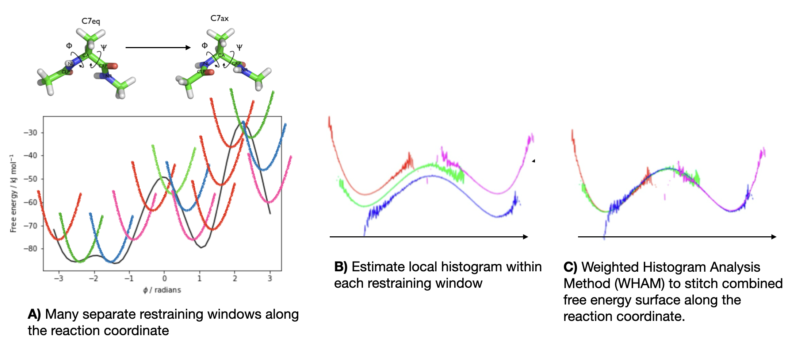

The weighted histogram analysis method (WHAM) provides a scheme for obtaining the optimal estimate of the unbiased histogram of $$\phi$$ from each of the biased probability distributions by accounting for each of the restraining potentials.From this estimate of the unbiased histogram along the reaction coordinate, we can construct an estimate of the **free energy surface** along this coordinate. 

For this tutorial you will work in new directory. Copy the tutorial files by typing in the terminal:

In the terminal type:

cp -r /opt/workshop/umbrella_sampling/ ~/


Then change directory to the umbrella_sampling directory: 


cd ~/umbrella_sampling/


Begin by preparing a GROMACS mdrun file by typing:


gmx grompp -f vacuum.mdp -c alanine_dipeptide.gro -p topol.top -o run_us.tpr


In the workshop tutorial files I have included a bash file called `run_us.sh` that will launch each separate restrained simulation from its own separate directory:


for AT in -3.00 -2.75 -2.50 -2.25 -2.00 -1.75 -1.50 -1.25 -1.00 \
          -0.75 -0.50 -0.25 0.00 0.25 0.50 0.75 1.00 1.25 \
          1.50 1.75 2.00 2.25 2.50 2.75 3.00
do

WINDOW="window_${AT}"
mkdir -p "${WINDOW}"

cat > "${WINDOW}/plumed.dat" << EOF
MOLINFO STRUCTURE=../diala.pdb

phi: TORSION ATOMS=@phi-2
psi: TORSION ATOMS=@psi-2

restraint-phi: RESTRAINT ARG=phi KAPPA=250.0 AT=${AT}

PRINT STRIDE=10 ARG=phi,psi,restraint-phi.bias FILE=COLVAR
EOF

cd "${WINDOW}"

gmx mdrun \
    -s ../run_us.tpr \
    -plumed plumed.dat \
    -nsteps 500000 \
    -deffnm umbrella \
    -nb cpu -nt 1 

cd ..

done


Launch all simulations by typing:

bash run_us.sh


This will take a few minutes to run since you are running 25 MD trajectories in serial. When this finishes you will see each trajectory has run from its own directory each with prefix `window_` followed by the restraint center value.   

To perform the WHAM merging of the windows we need to collect and merge all the simulation frames into a single trajectory. The bash script `concat_all.sh` will merge all the trajectories together. 


files=""

for AT in -3.00 -2.75 -2.50 -2.25 -2.00 -1.75 -1.50 -1.25 -1.00 \
          -0.75 -0.50 -0.25 0.00 0.25 0.50 0.75 1.00 1.25 \
          1.50 1.75 2.00 2.25 2.50 2.75 3.00
do
    AT=$(printf "%.2f" "$AT")
    files="$files window_${AT}/umbrella.trr"
done

gmx trjcat -f $files -cat -o concatenated.xtc
 

Run this script by typing:


bash concat_all.sh


Running this script will concatenate (stitch together) the separte trajectory files. The stiched together trajectory file is called `concatenated.xtc`. 

Next we need to run another PLUMED input to calculate the values for all the employed restraints applied on each frame. For this we can write a `plumed-wham.dat` file including all the biases used in the former simulations:


MOLINFO STRUCTURE=diala.pdb 
phi: TORSION ATOMS=@phi-2 
RESTRAINT ARG=phi KAPPA=250.0 AT=-3.00 
RESTRAINT ARG=phi KAPPA=250.0 AT=-2.75 
RESTRAINT ARG=phi KAPPA=250.0 AT=-2.50 
RESTRAINT ARG=phi KAPPA=250.0 AT=-2.25 
RESTRAINT ARG=phi KAPPA=250.0 AT=-2.00 
RESTRAINT ARG=phi KAPPA=250.0 AT=-1.75 
RESTRAINT ARG=phi KAPPA=250.0 AT=-1.50 
RESTRAINT ARG=phi KAPPA=250.0 AT=-1.25 
RESTRAINT ARG=phi KAPPA=250.0 AT=-1.00 
RESTRAINT ARG=phi KAPPA=250.0 AT=-0.75 
RESTRAINT ARG=phi KAPPA=250.0 AT=-0.50 
RESTRAINT ARG=phi KAPPA=250.0 AT=-0.25 
RESTRAINT ARG=phi KAPPA=250.0 AT=0.00 
RESTRAINT ARG=phi KAPPA=250.0 AT=0.25 
RESTRAINT ARG=phi KAPPA=250.0 AT=0.50 
RESTRAINT ARG=phi KAPPA=250.0 AT=0.75 
RESTRAINT ARG=phi KAPPA=250.0 AT=1.00 
RESTRAINT ARG=phi KAPPA=250.0 AT=1.25 
RESTRAINT ARG=phi KAPPA=250.0 AT=1.50 
RESTRAINT ARG=phi KAPPA=250.0 AT=1.75 
RESTRAINT ARG=phi KAPPA=250.0 AT=2.00 
RESTRAINT ARG=phi KAPPA=250.0 AT=2.25 
RESTRAINT ARG=phi KAPPA=250.0 AT=2.50 
RESTRAINT ARG=phi KAPPA=250.0 AT=2.75 
RESTRAINT ARG=phi KAPPA=250.0 AT=3.00 
PRINT ARG=*.bias FILE=biases.dat STRIDE=10 
PRINT ARG=phi FILE=allphi.dat STRIDE=10
 

Run this using the PLUMED driver on the concatenated trajectory by typing:


plumed driver --mf_xtc concatenated.xtc --plumed plumed-wham.dat
 

The python code `wham.py` will run the iterative WHAM optimization and get a weight per frame. Run this by typing:


python wham.py biases.dat 25 2.49
 

where 25 is the number of windows and 2.49 is $$RT$$ in units of kJ/mol. The result is a file called `weight.dat` with one weight per frame. We can assign this weight to each sampled $$\phi$$ value to compute the free energy profile along $$\phi$$. 

Then assign each $$\phi$$ value in `allphi.dat` to the weight by typing: 

paste allphi.dat weights.dat | grep -v \# > allphi-w.dat
  

This creates a file called `allphi-w.dat` which has a line for each $$\phi$$ value and its assigned weight:
 

 0.000000 -1.497988	0.002555818652810523585600099850
 10.000000 -2.756400	0.000404575092851750114323478025
 20.000000 -2.867971	0.000172305439814177655975455106
 30.000000 -2.952951	0.000073661040685496487591746306
 40.000000 -2.938855	0.000085439268700633757571381854
 50.000000 -2.870851	0.000167459192407052405221143387
 60.000000 -2.847128	0.000211116777873891916334977981
 70.000000 -2.914030	0.000109361274168485696819258512
 80.000000 -3.016811	0.000030548240369112431155055459
 90.000000 -2.908864	0.000115041781372963292486358289
 

The first column is the frame number, the second column is the $$\phi$$ value and the third column is the weight. Finally, we use this to construct the free energy surface with the provided code `do_fes.py`:


python do_fes.py allphi-w.dat 1 -3.1415 3.1415 50 2.49 fes.dat


The resulting free energy profile will be written to the output `fes.dat` file and produces a free energy surface that can be [plotted](https://colab.research.google.com/drive/1FSxQAO2pisEbRQzDytkxfOKfXR3LvHEn?usp=sharing) and looks like:

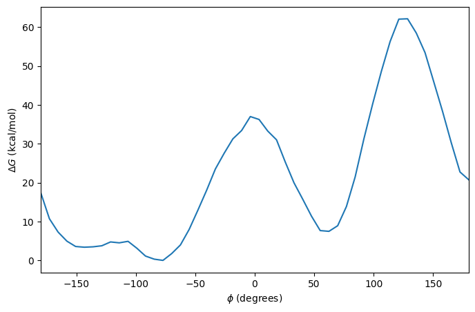

Congratulations, you have just performed a free energy calculation using umbrella sampling. When you have finished this section, you should move on to the [Metadynamics Tutorial](../../day2/metadynamics/metadynamics.md) 
