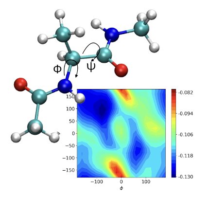

July 23-24, 2026
Western Washington University 

## Workshop topics 

 - Molecular dynamics simulation basics
 - Trajectory analysis
 - Free Energy Calculations
 - Data Analysis 

## Quick links 

 - [Schedule](schedule.md)
 - [Day 1](day1.md)
 - [Day 2](day2.md)

## Application 
 
 [Apply here](https://docs.google.com/forms/d/e/1FAIpQLSe6wiQBp8TRDA_zDYHhQHi9elrNPFrWgTqwdM1tvNrDB8PgIg/viewform?usp=header)
 
 **Location**: CB 385  
 **Time**: 9:00 AM - 4:00 PM, Thursday, July 23  
       9:00 AM - 4:00 PM, Friday, July 24   

